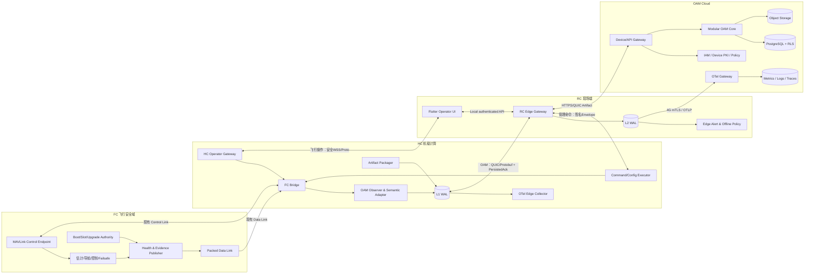
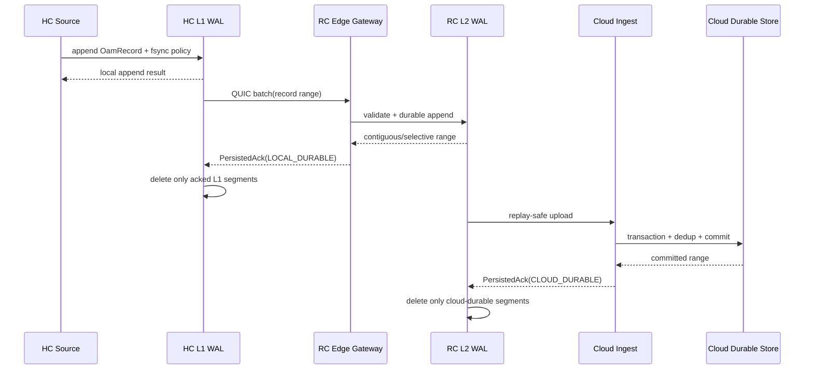
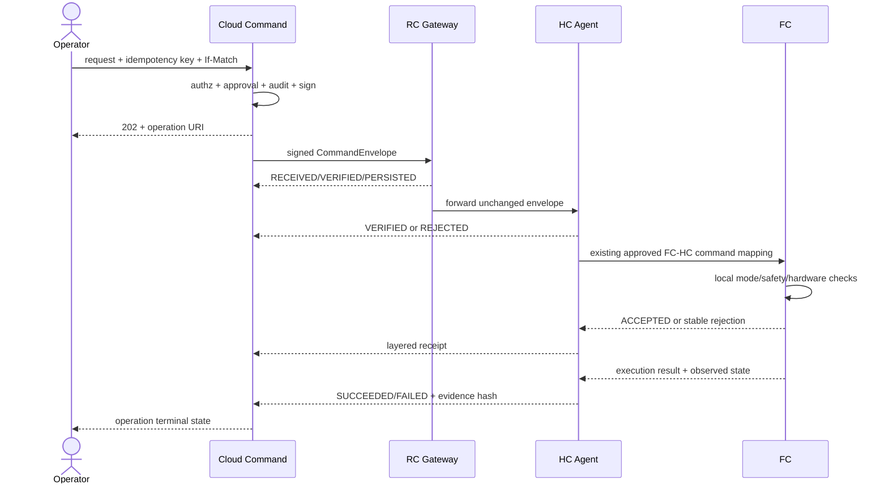
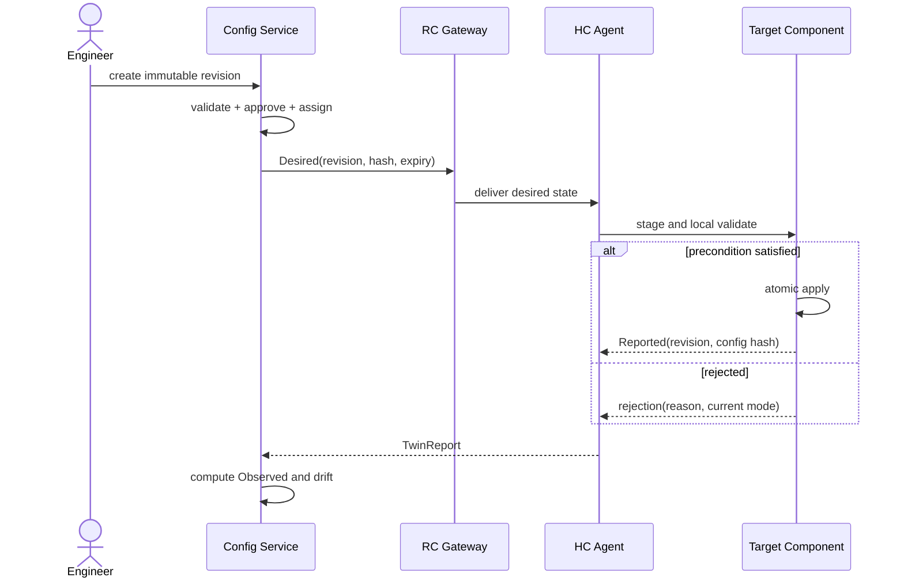
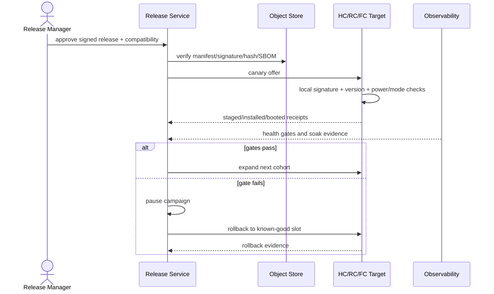
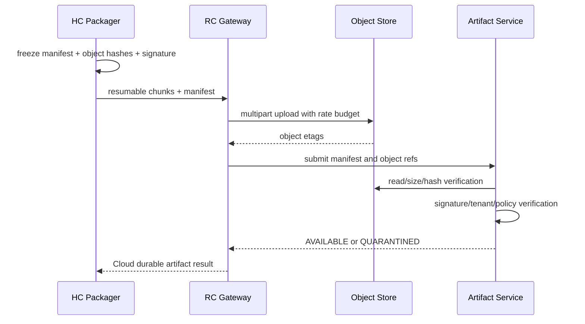
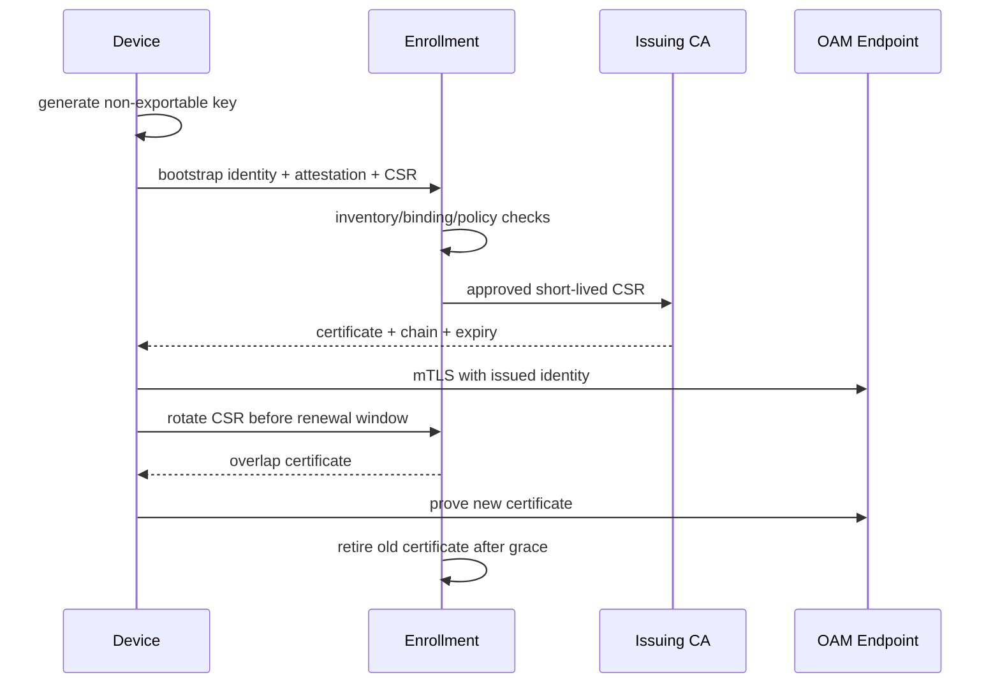

# AeroCore 工业级无人机 OAM 平台总体与实施设计

文档编号：`OAM-ARCH-001`  
版本：`v1.1-review-draft`  
日期：`2026-07-29`  
状态：`REVIEW_READY / NOT_IMPLEMENTED / NOT_PRODUCTION_APPROVED`  
代码基线：`aerocore@f65f78b0dc49bcd7b06b6c5107431a8f1fe9fdf5`  
适用对象：AeroCore FC、HC、RC、Cloud、外设、仿真与运维体系  

---

## 0. 文档控制

### 0.1 目的

本文定义 AeroCore 生产级无人机 OAM（Operations, Administration and
Maintenance）平台的目标架构、系统边界、接口、状态机、安全、可靠性、数据模型、
部署、验收和分阶段实施路线。

本文可以作为：

- 架构、安全和飞行软件联合评审输入；
- OAM 需求重新基线化的权威候选；
- FC、HC、RC、Cloud 模块拆分依据；
- Proto、OpenAPI、数据库和事件合同的上位设计；
- 工程 Backlog、测试计划和发布门禁的输入。

本文不是：

- 当前软件已经实现的声明；
- 当前 USX51 持久化、OTA、真实飞行或安全放行授权；
- 119 条 OAM 需求已通过的证据；
- safe-to-fly、flight-ready 或 production-ready 声明。

### 0.2 权威关系

在本文正式进入 AeroCore 文档目录并通过评审前，发生冲突时按以下顺序解释：

1. `AGENTS.md`、`PROJECT_RULES.md`；
2. `task_notes.md` 当前事实、权限和 promotion 边界；
3. `docs/04-protocols/protocol_alignment.md` 等已登记 current 合同；
4. 代码、配置和真实测试证据；
5. 本文；
6. 2026-05 Cloud/Fleet/OAM Draft 和其他历史说明。

正式接纳本文时，必须同步文档目录和 authority role，不能让历史 Draft 与本文同时宣称
OAM 总体架构权威。

### 0.3 输入基线

设计输入包括：

- AeroCore 当前代码与项目规则；
- FC-HC 双链路、airframe identity、A/B Boot、Flight Package 和质量体系；
- 2026-05 Cloud/Fleet/OAM 产品与架构 Draft；
- 2026-07-29 HC Flight Episode SD Capture Proposal；
- 无人机 OAM 绿地设计包中的 119 条需求、DD-01～DD-09、OpenAPI、Proto、SQL、
  OTel 配置和测试计划。

当前 `requirements-trace.json` 的 119 条需求全部为 `NOT_RUN`。本文只定义如何落地和验证，
不把 AeroCore 现有测试自动等价为 OAM 验收通过。

### 0.4 修订记录

| 版本 | 日期 | 变更 |
|---|---|---|
| v1.0-review-draft | 2026-07-29 | 建立AeroCore OAM总体架构、边界、实施路线和准入基线 |
| v1.1-review-draft | 2026-07-29 | 补充机器合同、API错误、RLS、权限、时序、STRIDE、容量、Epic、迁移和Runbook |

---

## 1. 执行摘要与架构决策

### 1.1 总体判断

AeroCore 已经具备生产 OAM 的良好底座：

- FC、HC、RC、Cloud 责任边界明确；
- FC-HC Control Link 和 Data Link 已分离；
- FC 已提供健康、调度、传感器、身份、日志、黑匣子和升级状态；
- HC 已具备日志封包、校验、回放和服务器基础；
- RC 已具备持久化 Fleet Sync、序列、ACK 和断网补传原型；
- Cloud 已具备 Flight Package ingest、SQLite 索引、回放和留存 MVP；
- Q0～Q7 / E0～E7 测试与证据模型能够承载 OAM 验收。

当前缺少的不是更多页面，而是生产管理面的基础能力：

- 稳定设备身份和 PKI；
- 默认拒绝的认证授权与租户隔离；
- HC L1 WAL、RC L2 WAL 和持久化 ACK；
- OTel 语义、Collector 和后端；
- 资产、数字孪生、命令、配置、OTA、Incident 和审计领域；
- 非对称固件签名；
- 高可用、灾备、SLO 和运行手册；
- 119 条需求的实际执行证据。

### 1.2 冻结候选决策

| ID | 决策 |
|---|---|
| OAD-001 | FC 是飞行安全最终权威。Cloud、RC、HC OAM 均不得绕过 FC 安全门控。 |
| OAD-002 | 不在 FC 实时路径嵌入 OTel SDK、HTTP、Cloud 客户端、通用 WAL 或证书业务。 |
| OAD-003 | 保留现有 FC-HC MAVLink Control Link 与 Packed Data Link，不按绿地设计重写。 |
| OAD-004 | HC 新增独立 `OAM Edge Agent`，负责 FC/ROS 2/OS/外设语义适配和 L1 WAL。 |
| OAD-005 | RC 的可靠上传、设备证书和离线自治从 Flutter UI 中拆为独立 Edge Gateway。 |
| OAD-006 | 飞行操作、OAM 遥测、管理命令、Artifact 四类流量具有独立队列、限流和失败语义。 |
| OAD-007 | HC-RC 飞行操作先保留现有 Proto/WebSocket 语义并升级到安全传输；OAM 使用独立 QUIC/Protobuf 连接。 |
| OAD-008 | RC-Cloud 使用 TLS 1.3 + mTLS；用户访问使用 OIDC + MFA；租户身份不信任客户端请求头。 |
| OAD-009 | 平台先采用模块化单体与清晰领域边界；只有容量、可用性或组织证据支持时才拆服务。 |
| OAD-010 | PostgreSQL 16 + RLS 保存业务状态；对象存储保存制品和证据；OTel 后端保存观测数据。 |
| OAD-011 | Flight Package 和 Flight Episode 是 Artifact 面，不进入实时 OTel/WAL 遥测载荷。 |
| OAD-012 | FC 固件生产升级必须完成 ECDSA P-256 验签；只有 CRC32 的镜像不得作为生产 OTA。 |
| OAD-013 | 所有命令和配置必须幂等、可审计、可回执；Trace 不作为执行成功证明。 |
| OAD-014 | 所有缺失、陈旧、未绑定或无法验证的证据 fail closed，不自动降级 promotion。 |

---

## 2. 范围、角色与硬约束

### 2.1 系统角色映射

| 逻辑角色 | AeroCore 实体 | 主要责任 |
|---|---|---|
| 飞行安全域 | FC | 确定性估计、导航、控制、Failsafe、最终命令拒绝、Boot/Slot 权威 |
| 机载计算与边缘采集 | HC | ROS 2、自主、FC桥接、日志、OAM Edge Agent、L1 WAL、Artifact封包 |
| 现场操作与边缘网关 | RC | 操作员交互、现场状态、L2 WAL、4G网关、离线自治 |
| 中心平台 | Cloud | 资产、孪生、命令、配置、OTA、观测、Incident、审计、留存和查询 |
| 受管对象 | FC/HC/RC/外设 | 报告身份、版本、配置、健康和执行回执 |
| 验证环境 | VM/SITL/HIL/无桨/飞行 | 按证据等级验证，不互相替代 |

### 2.2 拓扑事实

AeroCore 不是“PX4 与 ROS 2 主控同板”的直接实现。当前有两类产品 profile：

- `usx51`：USX51 自研 FC + RDK X5 HC，当前主要开发与无桨验证平台；
- `v6x_pi4`：CUAV V6X/FMUv6X FC + Raspberry Pi 4B HC，兼容目标。

OAM 业务模块不得按板名分叉。硬件差异由现有 target profile、capability descriptor 和
适配器吸收。

### 2.3 不变量

以下约束属于生产放行硬门禁：

1. OAM 故障不得增加 FC deadline miss、WCET overrun、UART drop 或控制延迟。
2. Cloud 或 4G 不可用时，飞行操作和 FC/HC 本地安全逻辑继续工作。
3. Data Link 不承载 HC→FC 控制命令。
4. FC 只接受 Control Link 上通过本地安全条件的控制或管理动作。
5. OAM 队列满、磁盘满、Collector失效时不得阻塞控制和关键ROS 2路径。
6. 未授权高风险动作默认拒绝；离线只执行预授权且可证明的动作。
7. Observed 状态不得覆盖设备 Reported 状态。
8. 网络 ACK 不得替代接收端持久化 ACK。
9. 未验证或未 ACK 的证据不得自动删除。
10. 仿真身份、证书、存储和命令权限与生产隔离。

---

## 3. 现状与目标差距

| 领域 | 当前状态 | 目标 |
|---|---|---|
| FC健康 | `0xB1/B2/B3/B9/BF/C0/C1` 等权威帧 | HC映射到统一OAM语义，不重复采集 |
| FC-HC协议 | MAVLink + Packed Data Link | 保持不变，仅增加有界低频OAM语义 |
| HC-RC | WebSocket + Proto，共享实时连接 | 飞行操作与OAM/管理传输隔离并加密 |
| RC持久化 | Flutter JSONL + ACK 状态 | 独立Gateway、L2 WAL、掉电一致性、优先级 |
| Cloud传输 | 明文HTTP/WS、本地Token | TLS/mTLS、默认拒绝、设备PKI和用户IAM |
| Cloud存储 | SQLite + 本地目录 | PostgreSQL RLS + 对象存储 + OTel后端 |
| 资产 | airframe/profile identity | 多租户资产树、稳定设备ID、证书和配对历史 |
| 孪生 | 无正式三状态模型 | Desired/Reported/Observed + Reconciliation |
| 可观测性 | 自有健康/日志，无OTel管线 | HC/RC/Cloud OTel，FC仍保持轻量 |
| 命令 | 分层ACK和状态观察 | 签名、Nonce、审批、幂等、跨重启恢复 |
| 配置 | 参数与profile | Revision、ETag、Schema、签名、回滚 |
| OTA | A/B、CRC、回滚状态机 | 签名Manifest、灰度、兼容矩阵、供应链证据 |
| Incident | Replay/报告为主 | 告警聚合、诊断上下文、工单和恢复闭环 |
| 部署 | 本地MVP和单机服务 | HA、备份恢复、容量、SLO和运行手册 |

---

## 4. 目标逻辑架构



### 4.1 四类通道

| 通道 | 数据 | 传输 | 可靠性 | 优先级 |
|---|---|---|---|---|
| Flight Operation | 摇杆、任务意图、模式、紧急动作 | 安全WSS/Proto→HC→MAVLink | 低延迟、有界、平台无关 | 最高 |
| OAM Telemetry | 快照、健康、结构化事件、运行指标 | QUIC/Proto→OTLP | 至少一次、去重、缺口检测 | P0～P3 |
| Management | 命令、配置、维护、OTA控制 | 签名Envelope、独立队列 | 幂等、状态机、完整审计 | 高 |
| Artifact | Flight Package、Episode、日志、固件 | 分片HTTPS/QUIC | 断点续传、SHA-256、Manifest | 最低/可调度 |

四类通道可以共享物理无线和4G，但不得共享无界队列、重试预算或应用层流控。

---

## 5. 组件分解与责任

### 5.1 FC OAM边界

FC 保留现有 owner，不新增通用平台依赖。

| 组件 | 责任 | 禁止事项 |
|---|---|---|
| Health Publisher | 发布CPU、heap、scheduler、UART、传感器和安全证据 | 不阻塞，不动态分配大对象 |
| Identity Reporter | 报告airframe、profile hash、actuator、版本和boot identity | 不信任RC/Cloud推断 |
| Boot/Upgrade Authority | Slot选择、镜像验证、确认和回滚 | 不依赖应用OAM决定安全启动 |
| Command Gate | 校验FC可执行条件并返回最终结果 | 不因Cloud已批准而跳过本地门控 |
| Blackbox/Log | 有界保留关键证据 | 不与实时数据争用不可控资源 |

推荐把现有帧映射为：

| FC帧 | OAM语义 |
|---|---|
| `0xB1 TIME_SYNC` | 时钟质量与数据可信度 |
| `0xB2 FC_EVIDENCE` | 安全/任务事件和执行证据 |
| `0xB3 FC_HEALTH` | FC资源与链路Metrics |
| `0xB5 BLACKBOX_CHUNK` | Artifact元数据和按需提取 |
| `0xB6 TEXT_LOG` | 结构化Event/Log输入 |
| `0xB9 SENSOR_INSTANCE` | 外设实例与健康 |
| `0xBF FC_AIRFRAME_IDENTITY` | Reported profile/actuator身份 |
| `0xC0/C1` | runtime、WCET、deadline和调度证据 |

### 5.2 HC OAM Edge Agent

建议新增独立 owner：`hc/src/aerocore_oam_edge/`。

子模块：

- `fc_health_adapter`：解析现有权威帧；
- `ros2_health_adapter`：采集节点、topic新鲜度和资源；
- `peripheral_adapter`：外设身份、版本、健康和故障；
- `semantic_normalizer`：转换到 OAM 统一语义；
- `priority_router`：P0～P3分类；
- `l1_wal`：本地持久化和补传；
- `command_executor`：验证并执行HC本地管理动作；
- `artifact_catalog`：Flight Package/Episode/诊断包引用；
- `otel_bridge`：输出Metrics、Events/Logs和Traces。

HC Agent 必须是低优先级独立进程。ROS 2订阅回调只进行有界复制和入队，磁盘、网络和压缩
由后台工作线程执行。

### 5.3 RC Edge Gateway

生产能力不得只存在于 Flutter UI 生命周期内。建议新增：

`rc/aerocore_edge_gateway/`

职责：

- RC设备身份和证书；
- HC-RC OAM QUIC会话；
- L2 WAL与Cloud持久化水位；
- 4G恢复、补传、限速和流量预算；
- 边缘P0/P1告警；
- 离线授权策略；
- Artifact缓存和上传；
- 为Flutter提供本地认证API。

平台差异：

- Linux遥控器：systemd service + 独立受限用户；
- Android遥控器：原生foreground/background service + Android Keystore；
- UI进程崩溃不得丢失Gateway队列或证书状态。

### 5.4 Cloud OAM Core

第一阶段采用模块化单体：

| 模块 | 责任 |
|---|---|
| Asset Registry | 资产树、能力、硬件/软件身份 |
| Device Binding | UAV、FC、HC、RC、外设的时态绑定 |
| Digital Twin | Desired/Reported/Observed与收敛 |
| Telemetry Ingest | 实时快照、事件、去重和缺口 |
| Command | 命令创建、审批、签名、状态和回执 |
| Configuration | Schema、Revision、ETag、目标和回滚 |
| Artifact | Flight Package、Episode、诊断包和固件元数据 |
| Release/OTA | 兼容矩阵、灰度、暂停、回滚 |
| Alert/Incident | 规则、聚合、抑制、恢复、诊断上下文 |
| Maintenance | 维护计划、累计器、复位和工单 |
| Audit | 用户、设备和系统行为审计 |
| Query | Fleet、历史、诊断和Replay查询 |

只有当单模块容量或组织边界有测量证据时，才拆为独立服务。

---

## 6. 资产身份与设备绑定

### 6.1 资产树

```text
Tenant
└── Fleet
    └── UAV
        ├── FC
        ├── HC
        ├── RC（时态绑定）
        └── Peripheral
            ├── IMU[n]
            ├── GNSS[n]
            ├── Barometer[n]
            ├── Magnetometer[n]
            ├── Camera[n]
            ├── LiDAR[n]
            └── Payload[n]
```

### 6.2 身份字段

每个受管设备至少具有：

- `tenant_id`；
- `asset_id`：平台稳定UUID；
- `device_id`：制造或入库阶段稳定ID；
- `device_type`；
- `hardware_model`、`hardware_revision`、`serial_number`；
- `certificate_subject`、`certificate_fingerprint`；
- `airframe_id`、`profile_hash`；
- `software_version`、`git_commit`、`config_hash`；
- `boot_id`、`boot_counter`；
- `environment`：production/SITL/SIL/HIL/field-test；
- `capability_profile`。

当前 `identity=1..5` 的 airframe配置只表示运行profile，不能作为全局设备身份。

### 6.3 配对

绑定必须有有效期：

```text
binding_id
uav_id
device_id
role
valid_from
valid_to
reason
approved_by
```

离线数据按事件时间和历史配对归属，不能按当前绑定错误归属。

### 6.4 证书引导

建议流程：

1. 制造/入库生成设备密钥或激活码；
2. 首次纳管校验硬件身份和所有权；
3. 颁发短生命周期设备证书；
4. 证书绑定 `tenant_id/device_id/environment`；
5. 支持轮换、吊销和丢失设备隔离；
6. 私钥优先存储于 TPM/安全元件/平台Keystore；
7. 无安全硬件时必须有风险接受与补偿控制。

---

## 7. 数字孪生

### 7.1 三状态模型

| 状态 | 权威来源 | 示例 |
|---|---|---|
| Desired | 平台 | 期望配置版本、期望固件、期望采样策略 |
| Reported | 设备 | 实际配置、版本、profile、执行结果 |
| Observed | 观测系统 | 在线状态、CPU、传感器健康、链路质量 |

Observed 不得覆盖 Reported。

### 7.2 收敛状态

```text
NOT_STARTED
  -> IN_PROGRESS
  -> CONVERGED
  -> FAILED
  -> TIMED_OUT
  -> BLOCKED
  -> CANCELLED
```

每次收敛记录：

- `reconciliation_id`；
- 目标Revision；
- 前置Reported版本；
- 当前Reported版本；
- deadline；
- failure reason；
- command/config/OTA引用；
- 审计和Trace引用。

### 7.3 ETag与并发

所有Desired写操作必须带：

- `If-Match`或等价ETag；
- `idempotency_key`；
- 操作者和审批上下文；
- 目标选择器展开后的不可变设备列表。

---

## 8. OAM语义与OpenTelemetry

### 8.1 信号边界

| 信号 | 使用范围 |
|---|---|
| Metrics | CPU、内存、温度、链路、WAL、传感器健康、计数器和新鲜度 |
| Events/Logs | 状态变化、故障、安全事件、审计引用和升级状态 |
| Traces | 命令、配置、OTA、Artifact上传和诊断工作流 |
| Artifact | ULog、黑匣子、core dump、Flight Package、Episode、固件 |

禁止把视频帧、点云、原始高频传感器、MAVLink实时控制和FC 1kHz路径直接进入OTel。

### 8.2 Resource属性

每条观测至少关联：

```text
oam.tenant.id
oam.fleet.id
oam.uav.id
device.id
oam.device.type
oam.airframe.id
oam.profile.hash
service.name
service.version
deployment.environment.name
device.boot.id
```

租户和设备权威属性由认证网关注入，客户端自报值只能作为声明值保存，不能用于授权。

### 8.3 Trace上下文

采用 W3C Trace Context：

- `traceparent`；
- `tracestate`；
- 受限 `baggage`。

管理消息分两层：

- `origin_trace_context`：发行方创建，业务签名保护，不可变；
- `transport_trace_context`：每跳重新注入，表达真实传输父子关系。

消息重传不能导致业务重复执行。WAL记录Trace引用，不依赖Trace恢复事务。

### 8.4 高基数与隐私

禁止把以下内容作为指标label或baggage：

- 精确经纬度；
- 用户姓名、电话和账号；
- 任务名称和客户名称；
- Artifact路径；
- 动态错误全文；
- token、密钥和权限结果。

平台必须记录非法语义、高基数拒绝和敏感字段清洗计数。

---

## 9. 两级WAL与弱网可靠性

### 9.1 数据路径

```text
HC L1 WAL
   │ RC持久化后返回PersistedAck
   ▼
RC L2 WAL
   │ Cloud持久化后推进cloud_ack_seq
   ▼
Cloud
```

网络层ACK、QUIC流ACK或HTTP 2xx不能替代应用持久化ACK。

### 9.2 记录信封

`OamRecord`至少包含：

```text
schema_version
tenant_id
uav_id
source_device_id
boot_id
session_id
sequence
priority
signal_kind
event_time
observed_time
payload_type
payload
payload_sha256
origin_trace_context
privacy_class
```

幂等键：

```text
source_device_id + boot_id + sequence
```

### 9.3 PersistedAck

```text
source_device_id
boot_id
highest_contiguous_sequence
missing_ranges[]
receiver_free_bytes
receiver_watermark
receiver_boot_id
ack_time
signature_or_session_mac
```

发送端只能在收到匹配接收端和session的持久化ACK后释放记录。

### 9.4 优先级

| 级别 | 数据 | 淘汰策略 |
|---|---|---|
| P0 | 安全事件、命令回执、身份/证书事件、升级结果 | 不主动淘汰 |
| P1 | 设备健康、状态变化、关键链路和配置状态 | 高优先保留 |
| P2 | 诊断指标、低频明细和普通Trace | 超期后可淘汰 |
| P3 | Debug、高频Trace和可重建信息 | 最先采样/淘汰 |

P0空间不足时必须：

1. 停止接纳P2/P3；
2. 降采样P1；
3. 产生本地不可忽略告警；
4. 绝不阻塞飞行路径；
5. 不伪造“已记录”状态。

### 9.5 容量

每个硬件profile按实测冻结：

```text
WAL容量 = 峰值有效字节率 × 最大断网目标 × 1.5
```

还必须验证：

- 文件系统和数据库写放大；
- 存储寿命；
- 掉电一致性；
- segment恢复时间；
- 启动扫描上限；
- P0保留空间；
- low/critical watermark；
- 72小时或产品定义的长稳。

容量不能只按平均流量估算。

### 9.6 存储格式

推荐：

- append-only segment；
- segment header含版本、boot、序列范围；
- 每条CRC，segment关闭时SHA-256；
- 索引可重建；
- metadata使用原子替换；
- segment上限和记录上限固定；
- 损坏segment隔离，不阻断其他segment恢复。

---

## 10. 无线与传输协议

### 10.1 HC-RC

目标：

- Flight Operation：安全WSS/Proto，保留现有语义和低延迟路径；
- OAM Telemetry：独立QUIC连接，多Stream按优先级；
- Management：独立签名消息队列，可使用专用QUIC连接；
- Artifact：低优先级分片传输。

OAM QUIC连接负责：

- TLS 1.3；
- 连接迁移；
- 多Stream；
- 丢包恢复；
- 有界流控；
- 会话恢复。

应用层仍负责：

- session/boot/sequence；
- 持久化ACK；
- 去重和缺口；
- 优先级与淘汰；
- 接收容量反馈；
- 业务签名和幂等。

### 10.2 RC-Cloud

- OTel：OTLP/HTTP或OTLP/gRPC over mTLS；
- 设备API：HTTPS/HTTP2或HTTP3；
- 命令下行：长连接或有界轮询，必须签名；
- Artifact：resumable upload，chunk SHA-256 + archive SHA-256；
- 所有连接使用设备证书和server name校验。

### 10.3 兼容与迁移

第一阶段不强制删除现有WebSocket。迁移顺序：

1. 加入认证与WSS；
2. 新增OAM QUIC旁路；
3. 迁移健康和Fleet Sync；
4. 验证优先级隔离；
5. 再决定是否迁移非飞行管理消息；
6. Flight Operation变更单独作为L3评审。

---

## 11. 命令、配置与维护

### 11.1 命令信封

`CommandEnvelope`至少包含：

```text
schema_version
command_id
tenant_id
target_device_id
command_type
risk_level
parameters
created_at
not_before
expires_at
nonce
idempotency_key
preconditions[]
approval_id
issuer
origin_trace_context
signature_algorithm
signature
```

### 11.2 校验顺序

```text
认证会话
 -> Schema和大小
 -> 目标/租户
 -> 发行者签名
 -> not_before/expires_at
 -> Nonce/重放
 -> 幂等记录
 -> RBAC/ABAC
 -> 审批
 -> 设备能力
 -> 飞行阶段/本地前置条件
 -> 执行
 -> 签名回执
 -> 审计
```

失败顺序是合同的一部分，不能为方便测试改变。

### 11.3 命令状态机

```text
CREATED
 -> AUTHORIZED
 -> QUEUED
 -> DELIVERED_TO_RC
 -> DELIVERED_TO_HC
 -> DELIVERED_TO_FC
 -> ACCEPTED
 -> RUNNING
 -> SUCCEEDED
 -> FAILED
 -> REJECTED
 -> EXPIRED
 -> CANCELLED
 -> ROLLED_BACK
```

HC ACK、FC ACK和状态Observed必须分别保存，不能把“已转发”展示为“已执行”。

### 11.4 幂等

执行端持久化：

```text
command_id
idempotency_key
payload_hash
first_seen_at
state
result_hash
receipt
```

同一幂等键不同payload必须拒绝；相同payload重传返回原结果，不重新执行。

### 11.5 配置

配置对象包含：

- `schema_id/schema_version`；
- 单调`revision`；
- `etag`；
- `previous_revision`；
- `target_selector`和展开结果；
- `content_sha256`；
- 发行签名；
- 生效窗口；
- 回滚Revision；
- 安全影响等级。

设备报告下载、校验、应用、重启需求、健康确认和回滚状态。

### 11.6 维护

维护模块管理：

- 飞行小时、起降次数和部件累计器；
- 保养计划；
- 故障确认和清除；
- 部件更换；
- 校准；
- 工单；
- 维护复位前后快照。

累计器必须单调，时间修正和重启不得倒退。复位必须双人审批或等价强控制。

### 11.7 告警、Incident与诊断

告警分两层：

- Edge Alert：RC/HC在Cloud不可用时仍能发现P0/P1问题；
- Platform Alert：跨设备、跨时间和多信号关联。

告警实例状态：

```text
PENDING
 -> FIRING
 -> ACKNOWLEDGED
 -> RESOLVED
 -> CLOSED
```

`SUPPRESSED`和`SILENCED`是有时限、有owner和审计的附加属性，不替代真实状态。

平台按去重键、资产拓扑、时间窗口和因果证据聚合Incident：

```text
OPEN
 -> INVESTIGATING
 -> MITIGATED
 -> RESOLVED
 -> CLOSED
 -> REOPENED
```

每个Incident生成版本化 `DiagnosisContext`：

- 资产与历史配对；
- 事件时间窗和时钟质量；
- 指标查询与异常基线；
- 结构化事件；
- Command/Config/OTA状态；
- Trace引用；
- Flight Package、黑匣子和其他Artifact引用；
- 数据缺口和新鲜度；
- 已执行动作；
- 推荐下一步和置信度。

AI可以生成摘要、证据导航和建议，但不得直接发行管理命令。任何建议转成动作时必须重新走
用户授权、策略、审批、签名和设备安全门控。

---

## 12. OTA与供应链

### 12.1 制品模型

`Artifact`：

```text
artifact_id
component_type
version
object_uri
size_bytes
sha256
media_type
sbom_uri
provenance_uri
signature
created_by
created_at
```

`UpgradeManifest`：

```text
manifest_id
artifact_id
supported_hardware[]
supported_airframes[]
required_bootloader
required_previous_versions[]
min_battery
allowed_flight_states[]
install_strategy
health_checks[]
rollback_policy
signature
```

### 12.2 FC固件

生产前必须：

- Bootloader集成ECDSA P-256验证；
- 公钥位于Bootloader只读区或安全元件；
- 镜像头、payload和Manifest全部绑定；
- 防版本回退策略明确；
- A/B Boot-Control原子；
- testing slot超时与回滚；
- 断电矩阵通过。

当前“拒绝声明签名的镜像”是安全的临时fail-closed策略，但不是生产签名OTA完成。

### 12.3 HC与RC

- 使用签名包和锁定依赖；
- 安装前校验平台profile、空间和服务健康；
- 原子切换或A/B根文件系统/容器版本；
- systemd health check；
- 支持回滚；
- 升级不得自动扩大权限。

### 12.4 Campaign

```text
DRAFT
 -> APPROVED
 -> CANARY
 -> ROLLING
 -> PAUSED
 -> COMPLETED
 -> FAILED
 -> ROLLED_BACK
```

灰度维度：

- tenant/fleet；
- hardware/profile；
- 当前版本；
- 地理或运营组；
- 维护窗口；
- 健康基线。

任何安全指标恶化自动暂停，不自动放宽阈值继续。

---

## 13. Artifact、Flight Package与Episode

### 13.1 三类Artifact

| 类型 | 产生方 | 用途 |
|---|---|---|
| Flight Package | HC/RC | 单次飞行/仿真证据、Replay、QA |
| Diagnosis Package | HC/Cloud | Incident时间窗、日志、配置和Trace引用 |
| Flight Episode | HC Recorder | AI/Intelligence多流数据集输入 |

### 13.2 生命周期

继承现有合同：

```text
recording
 -> sealed
 -> packaged
 -> rc_cached
 -> cloud_uploading
 -> cloud_verified
 -> retention_eligible
 -> pruned
```

硬约束：

- active recording不删除；
- 未验证package不删除；
- 未ACK fleet消息不归档；
- cleanup默认dry-run；
- 删除package时索引和对象一致更新；
- legal hold覆盖普通留存；
- 每次清理产生审计事件。

### 13.3 Flight Episode边界

Episode保持独立 L3计划：

- OBSERVE-only；
- 独立有界队列和低优先级writer；
- `.partial -> finalize -> READY-last`；
- 满盘、只读、拔出、I/O error和掉电fail closed；
- 不因H1采集通过而宣称飞行或模型production-ready；
- OAM只保存Episode元数据、状态和对象引用。

---

## 14. 平台接口与事件

### 14.1 REST资源

建议以OpenAPI 3.1冻结：

```text
/v1/assets
/v1/assets/{id}/bindings
/v1/twins/{asset_id}
/v1/twins/{asset_id}/desired
/v1/commands
/v1/commands/{id}
/v1/config-revisions
/v1/artifacts
/v1/releases
/v1/releases/{id}/targets
/v1/incidents
/v1/maintenance/work-orders
/v1/audit-events
/v1/telemetry/query
```

所有写接口支持：

- `Idempotency-Key`；
- `If-Match`；
- request ID；
- 审计上下文；
- 结构化错误码；
- 分页和限制；
- 租户由认证上下文确定。

### 14.2 领域事件

Outbox事件至少包括：

```text
asset.registered
asset.binding.changed
twin.reported.updated
twin.reconciliation.changed
command.state.changed
config.reconciliation.changed
artifact.verified
release.target.state.changed
incident.state.changed
maintenance.work_order.changed
audit.event.recorded
```

事件包含：

```text
event_id
event_type
event_version
tenant_id
aggregate_type
aggregate_id
aggregate_version
occurred_at
trace_id
payload
```

平台先使用PostgreSQL Outbox。只有吞吐、解耦或跨区域需求有证据时才引入NATS JetStream等总线。

### 14.3 兼容性规则

- Proto只新增字段，不复用已删除字段号，删除字段必须`reserved`；
- 领域事件使用显式`event_version`，消费者先兼容后升级生产者；
- OpenAPI破坏性变更使用新major路径或明确兼容窗口；
- 数据库迁移采用expand/contract，滚动升级期间新旧版本可并存；
- Artifact和WAL格式必须保留旧版本读取器或提供离线迁移器；
- 未识别的安全关键枚举默认拒绝，普通观测字段允许保留未知字段；
- 所有跨组件合同变更运行生产者、消费者和旧版本fixture。

---

## 15. 数据与存储

### 15.1 PostgreSQL领域表

核心表：

```text
tenants
fleets
assets
asset_bindings
device_credentials
twin_desired
twin_reported
twin_observed_summary
reconciliations
commands
command_receipts
command_idempotency
config_schemas
config_revisions
artifacts
upgrade_manifests
release_campaigns
release_targets
incidents
incident_events
maintenance_work_orders
audit_events
outbox_events
```

所有业务表含 `tenant_id` 并启用RLS。应用事务必须设置租户上下文，应用角色不能拥有
`BYPASSRLS`。

### 15.2 存储分工

| 数据 | 存储 |
|---|---|
| 资产、孪生、命令、配置、OTA、工单 | PostgreSQL |
| Metrics | Prometheus兼容/Mimir |
| Logs/Events | Loki或等价日志后端 |
| Traces | Tempo或等价Trace后端 |
| Package、Episode、固件、诊断包 | S3兼容对象存储 |
| 审计长期副本 | Object Lock/WORM或等价不可变存储 |

### 15.3 数据时间

保存：

- `event_time`：设备事件时间；
- `observed_time`：网关观测时间；
- `ingested_time`：平台持久化时间；
- `clock_domain`；
- `clock_quality`；
- `time_sync_age`。

查询必须能够区分事件晚到和设备当前仍异常。

---

## 16. 安全架构

### 16.1 信任边界

| 边界 | 控制 |
|---|---|
| 用户→平台 | OIDC、MFA、RBAC/ABAC、短会话 |
| RC→平台 | 设备证书、mTLS、吊销、速率限制 |
| HC→RC | TLS 1.3、设备配对、会话密钥 |
| 平台→设备命令 | 业务签名、Nonce、有效期、审批 |
| OTA | 制品签名、Manifest签名、Bootloader验签 |
| 租户 | 服务端tenant、PostgreSQL RLS、缓存键隔离 |
| Artifact | SHA-256、签名、访问控制、对象锁 |

### 16.2 推荐组件

可选基线：

- 用户与服务身份：Keycloak或兼容OIDC；
- 设备PKI：step-ca或企业CA；
- 策略：OPA；
- 密钥：OpenBao/Vault或云KMS；
- 制品签名：Cosign；
- 网关：Envoy/NGINX；
- 安全扫描：SBOM、SCA、容器和secret scan。

组件可以替换，但合同和安全属性不能降低。

### 16.3 默认拒绝

生产配置缺少以下任一项时服务不得启动为对外模式：

- TLS证书；
- 信任根；
- 设备认证策略；
- 用户认证策略；
- 租户解析器；
- 审计写入；
- 密钥存储；
- 数据库RLS迁移。

当前“未配置token则允许”只能保留在显式local-dev profile。

### 16.4 审计

必须审计：

- 登录、拒绝和权限变化；
- 资产、配对和证书；
- 命令创建、审批、投递和执行；
- 配置变化；
- OTA、暂停和回滚；
- 维护复位；
- Artifact访问与删除；
- 留存、legal hold和Waiver；
- 策略和密钥操作。

审计事件含actor、device、tenant、action、target、before/after hash、result、reason、time和trace。
敏感值只保存摘要或引用。

### 16.5 威胁场景

最少验证：

- 伪造设备和证书；
- 跨租户IDOR；
- 命令重放和过期；
- 相同幂等键不同payload；
- 恶意/超限Proto和JSON；
- 路径穿越和符号链接逃逸；
- Artifact zip bomb；
- 高基数和日志注入；
- Baggage越权；
- OTA降级和签名替换；
- 时钟回退；
- 被盗RC离线滥用；
- WAL篡改和ACK伪造。

### 16.6 数据分类与隐私

至少使用四级分类：

| 等级 | 示例 | 处理 |
|---|---|---|
| Public | 公开版本说明、匿名健康统计 | 可公开但需完整性保护 |
| Internal | 一般设备指标、非敏感运行状态 | 租户和员工权限控制 |
| Confidential | 精确位置、任务、客户现场、设备序列号 | 加密、最小访问和限定留存 |
| Restricted | 密钥、凭据、个人信息、未脱敏图像 | 专用存储、强审批、禁止进入日志 |

每个字段和Artifact类型登记：

- 数据owner；
- 业务目的；
- 合法性/授权来源；
- 地域与租户限制；
- 保留与删除；
- 脱敏策略；
- 是否允许进入日志、Trace、Baggage和训练集。

位置、视频和Flight Episode默认按Confidential或Restricted处理。生产数据不得未经批准进入
开发、仿真或AI训练环境。

---

## 17. 部署、高可用与灾备

### 17.1 Edge部署

HC/RC Gateway：

- 独立低权限用户；
- systemd或平台等价服务；
- 最小Linux capability；
- 根文件系统只读优先；
- 专用数据目录；
- 明确CPU、内存、IO和磁盘配额；
- watchdog、restart backoff和启动依赖；
- 配置与证书原子更新；
- 服务失败不触发FC输出变化。

### 17.2 Cloud部署

生产建议：

- Device/API Gateway至少2实例；
- OAM Core无状态副本；
- PostgreSQL主备和WAL归档；
- 对象存储版本化与跨故障域复制；
- OTel Gateway水平扩展；
- 后台任务有租约、幂等和重试上限；
- 数据库迁移支持前向兼容和回滚计划；
- 环境分为dev/staging/production；
- 生产与仿真CA、租户、Bucket和数据库隔离。

不要求第一天拆成微服务或上复杂Kubernetes；但生产部署必须有编排、健康检查、滚动升级、
容量和故障域设计。

### 17.3 备份恢复

至少覆盖：

- PostgreSQL PITR；
- 对象存储清单和版本；
- PKI/策略/配置备份；
- 审计副本；
- 灾难恢复演练；
- 单租户恢复；
- 误删除恢复；
- 密钥轮换和CA灾难方案。

恢复演练必须验证业务一致性，不只验证文件存在。

### 17.4 OAM平台自监控

平台自身至少监控：

- Device Gateway连接数、认证失败和证书到期；
- ingest速率、拒绝、重复、缺口和晚到；
- PostgreSQL连接、复制延迟、锁、膨胀和备份；
- Outbox backlog和消费者延迟；
- Collector拒绝、队列、导出失败和高基数；
- 对象存储错误、容量和不完整Multipart；
- 命令、配置和OTA各状态停留时间；
- Incident和告警积压；
- 审计写入失败；
- 每租户资源用量和限额。

审计或安全关键持久化失败时，相关写操作必须fail closed；普通观测后端异常不得阻塞飞行。

---

## 18. 初始SLO与资源目标

以下是进入M0评审的初始目标，必须在真实容量与硬件基线后冻结。

| 指标 | 初始目标 |
|---|---|
| 飞行安全隔离 | 开启OAM后FC deadline/WCET/drop相对冻结基线零不可接受回归 |
| P0本地持久化 | 记录被L1接纳后，在设计故障模型内不丢失、不主动淘汰 |
| 命令幂等 | 重复投递不得重复执行；结果一致率100% |
| 在线P0事件可见性 | 端到平台p95 ≤ 5秒 |
| 在线P1状态可见性 | p95 ≤ 15秒 |
| Fleet快照新鲜度 | 在线状态p95 ≤ 10秒 |
| 平台API可用性 | 月度 ≥ 99.9%，不影响飞行安全 |
| 审计完整性 | 受控动作100%产生可验证审计记录 |
| 租户隔离 | 自动化跨租户负例0绕过 |
| Artifact完整性 | 已verified Artifact哈希不一致率0 |
| 业务数据RPO | 已ACK命令/审计为0；普通业务≤5分钟 |
| 平台RTO | ≤60分钟，最终按运营等级冻结 |

容量计划至少包含：

- 飞机数量、在线率和每机字节率；
- 事件突发；
- 最大断网；
- Artifact日增量；
- 查询保留；
- OTel label基数；
- PostgreSQL TPS和存储增长；
- 对象存储生命周期；
- Collector和Gateway冗余。

---

## 19. 故障模型与恢复

| 故障 | 预期行为 |
|---|---|
| Cloud不可达 | L2缓存，现场操作继续 |
| 4G断连 | RC本地告警和补传，不阻塞HC |
| HC-RC断连 | HC L1缓存，FC继续，未授权管理动作拒绝 |
| HC OAM崩溃 | systemd恢复；FC和关键ROS 2不受影响 |
| RC UI崩溃 | Gateway和L2继续运行 |
| RC Gateway崩溃 | 重启恢复WAL，不推进未持久化水位 |
| L1/L2磁盘满 | P3→P2淘汰；P0不阻塞飞行；产生告警 |
| WAL segment损坏 | 隔离损坏段，报告缺口，其他段继续 |
| Collector失效 | 本地重试/丢低优先级，业务路径不阻塞 |
| PostgreSQL故障 | 网关拒绝不安全写，已有设备继续自治 |
| 对象存储故障 | Artifact保持pending，不能标记verified |
| 时钟异常 | 标记低质量，保留arrival time，不伪造顺序 |
| 命令回执丢失 | 重查幂等记录，禁止猜测成功 |
| OTA掉电 | Bootloader选择已确认slot或回滚 |
| 证书吊销 | 新连接拒绝，现有连接按策略终止 |

---

## 20. 119条需求实施映射

| 需求域 | 数量 | AeroCore owner | 主要产物 |
|---|---:|---|---|
| CON | 7 | System/FC/HC/RC | 拓扑、不变量、隔离门禁 |
| AST | 10 | Cloud/HC/Interfaces | 资产、配对、孪生、身份Proto |
| OBS | 18 | HC/RC/Cloud | 语义目录、OTel、Trace、查询 |
| LNK | 12 | HC/RC/Interfaces | QUIC、L1/L2 WAL、ACK、弱网测试 |
| LOG | 7 | FC/HC/RC/Cloud | 结构化事件、Flight Package、Artifact |
| CMD | 10 | Cloud/RC/HC/FC | 命令Envelope、审批、幂等和回执 |
| OTA | 9 | FC/HC/RC/Cloud | Manifest、签名、Campaign、回滚 |
| MNT | 8 | Cloud/HC | 累计器、维护计划、工单和复位 |
| ALM | 8 | RC/Cloud | 边缘告警、Incident、诊断上下文 |
| SEC | 9 | Security/All | PKI、IAM、RLS、审计、密钥 |
| SIM | 7 | Simulation/Quality | SITL/SIL/HIL隔离与合同一致性 |
| NFR | 14 | System/Quality/Ops | SLO、容量、资源、HA、DR |

每条需求必须补充：

- AeroCore目标模块；
- 公开合同；
- 测试场景；
- 证据等级；
- 实际status；
- artifact URI/hash；
- waiver及到期时间。

在全部 `NOT_RUN` 转为真实状态前，不得宣称OAM需求验收完成。

---

## 21. 测试、证据与发布门禁

### 21.1 Q/E映射

| 层级 | OAM验证 |
|---|---|
| Q0/E0 | Schema、OpenAPI、Proto兼容、配置、secret、文档和依赖 |
| Q1/E1 | WAL、状态机、幂等、签名、RLS辅助、规则和纯函数 |
| Q2/E2 | HC Agent、RC Gateway、Cloud模块、Collector组件 |
| Q3/E3 | FC帧→语义、端到端Proto、数据库迁移、Artifact回放 |
| Q4/E4 | FC-HC-RC-Cloud VM、断联、乱序、重放和恢复 |
| Q5/E5 | 容量、72小时soak、峰值、故障矩阵和DR演练 |
| Q6/E6 | 无桨实机、4G、掉电、存储、证书和资源 |
| Q7/E7 | 独立授权的受控飞行观察；不自动扩展飞行包络 |

### 21.2 必测场景

- 三通道/四通道隔离；
- OAM进程强杀、CPU/RSS耗尽和满盘；
- L1/L2掉电一致性；
- 丢包、抖动、乱序、重复和长断连；
- P0/P1保留和P3淘汰；
- 命令伪造、越权、重放、过期、重复；
- 配置ETag冲突和回滚；
- OTA签名、兼容、断电和回滚；
- 证书轮换、吊销和设备冒用；
- PostgreSQL RLS和仿真/生产隔离；
- Artifact路径、zip和哈希攻击；
- Collector失效和高基数攻击；
- 备份恢复和区域故障；
- 2倍峰值与长稳；
- HC/RC关闭OAM后的回滚等价。

### 21.3 Evidence Manifest

每次正式运行记录：

```text
run_id
candidate_git_commit
config_hash
environment_id
device_ids
started_at
finished_at
result
q_level
evidence_level
promotion_ceiling
artifacts[]
artifact_sha256[]
not_claimed[]
```

---

## 22. 分阶段实施路线

### M0：权威与合同冻结

交付：

- 本文进入AeroCore current文档目录；
- 119条需求重映射；
- ADR与决策登记；
- OAM组件和Quality gate目录；
- Proto/OpenAPI/SQL/事件Schema草案；
- 安全威胁模型和数据分类；
- WAL、容量、SLO测量计划。

退出条件：

- 拓扑、owner、接口和非目标通过联合评审；
- 开放决策有owner、截止里程碑和阻塞范围；
- 不修改飞行运行行为。

### M1：安全只读Fleet

交付：

- Cloud默认拒绝；
- HTTPS/WSS和设备mTLS；
- 设备注册、资产树和绑定；
- RC Gateway最小服务；
- FC健康到Cloud只读链路；
- PostgreSQL RLS；
- 审计。

退出条件：

- 跨租户和伪造设备测试通过；
- OAM失效不影响飞行；
- 只读Fleet不含管理动作。

### M2：两级WAL与观测

交付：

- HC L1、RC L2；
- PersistedAck；
- 优先级和容量水位；
- OTel语义和Collector；
- 弱网、掉电和满盘门禁。

退出条件：

- Q4弱网矩阵通过；
- Q5长稳通过；
- Q6无桨资源隔离通过；
- 不存在网络ACK误当持久化ACK。

### M3：孪生、命令与配置

交付：

- Desired/Reported/Observed；
- 命令安全Envelope；
- 审批、签名、幂等和回执；
- 配置Revision/ETag/回滚；
- 现场离线策略。

退出条件：

- 所有安全负例通过；
- 跨重启不重复执行；
- HC/FC前置条件不可绕过。

### M4：Artifact、Incident与维护

交付：

- Flight Package生产存储；
- Diagnosis Package；
- Incident和诊断上下文；
- 维护累计器和工单；
- tenant retention/legal hold；
- Flight Episode只读引用。

退出条件：

- 未验证证据不删除；
- Incident可重放完整时间窗；
- cleanup全审计。

### M5：签名OTA

交付：

- FC ECDSA验签；
- HC/RC签名包；
- Artifact/Manifest/SBOM；
- Campaign、Canary、暂停和回滚；
- 兼容矩阵。

退出条件：

- 坏签名、降级、断电、超时和回滚矩阵通过；
- 实板操作具有独立授权；
- 未批准profile不能接收升级。

### M6：生产运营与准入

交付：

- HA、容量、备份恢复和DR；
- SLO/SLI和On-call；
- 安全审计、漏洞和密钥轮换；
- 119条需求正式证据；
- 发布与回滚Runbook。

退出条件：

- 所有P0阻塞关闭；
- 无未到期高危安全问题；
- DR演练通过；
- 生产候选证据可离线复核；
- 明确 `not_claimed`，不借OAM准入宣称safe-to-fly。

---

## 23. 开放决策

| ID | 决策 | 阻塞 |
|---|---|---|
| OD-001 | 冻结Ubuntu/ROS 2/DDS/FC版本和镜像摘要 | HC Agent、HIL |
| OD-002 | 按实测冻结L1/L2断网目标、容量和存储寿命 | WAL |
| OD-003 | 冻结首批受管外设BOM和诊断能力矩阵 | Asset/Adapter |
| OD-004 | 批准信号、Artifact、位置和个人数据留存策略 | Storage/Retention |
| OD-005 | 确认USX51/RC密钥硬件能力和异常策略 | PKI/OTA |
| OD-006 | 批准不同飞行阶段的链路失联与离线管理策略 | Command/Safety |
| OD-007 | 冻结HC-RC飞行操作WSS与OAM QUIC的端口、QoS和证书模型 | Transport |
| OD-008 | 决定RC Gateway的Linux/Android产品承载形式 | RC |
| OD-009 | 冻结平台部署规模、可用性等级、RPO/RTO | Cloud/Ops |
| OD-010 | 批准FC防回滚版本策略和信任根更新机制 | OTA |

每个开放决策必须记录owner、due milestone、候选方案、否决理由、关闭证据和回滚影响。

---

## 24. 主要风险与控制

| 风险 | 控制 |
|---|---|
| OAM侵入实时路径 | FC轻量发布、HC异步适配、硬实时回归门禁 |
| Flutter承担过多后台责任 | 独立RC Gateway，UI只做交互 |
| 文档与实现再次分叉 | 单一权威文档、机器合同、trace和CI |
| WAL写放大损坏介质 | 实测容量、segment、批量、寿命和watermark |
| 多租户越权 | 服务端tenant、RLS、负例和审计 |
| OTA供应链攻击 | ECDSA、SBOM、provenance、兼容矩阵和防降级 |
| OTel高基数拖垮平台 | 语义目录、label allowlist、限额和拒绝计数 |
| Artifact吞噬链路 | 独立低优先级通道、带宽预算和暂停 |
| 时钟不可信导致误诊 | 多时间戳、clock quality和禁止错误覆盖 |
| OAM成功被误写为飞行安全 | Q/E证据边界和not_claimed |
| 过早微服务化 | 模块化单体，按测量证据拆分 |
| 历史Draft混淆权威 | 文档catalog和生命周期清理 |

---

## 25. 生产完成定义

只有以下全部成立，才能把 AeroCore OAM 称为生产级：

1. 当前架构、接口和安全设计正式评审通过。
2. 119条需求均有真实状态和可验证证据。
3. OAM开启与故障均不造成FC/HC关键路径不可接受回归。
4. 所有生产连接加密，设备和用户身份可轮换、吊销和审计。
5. 跨租户、重放、越权、恶意输入和供应链负例全部通过。
6. HC L1、RC L2、Cloud去重和持久化ACK在掉电与断网场景通过。
7. P0数据不主动淘汰，P1～P3策略与容量已冻结。
8. 命令和配置跨重启幂等，回执不依赖推断。
9. FC、HC、RC OTA具有签名、兼容、灰度和自动回滚。
10. Artifact生命周期、legal hold、删除和恢复可审计。
11. 平台HA、备份、PITR、对象恢复和DR演练通过。
12. SLO有实时监测、告警、容量预测和On-call Runbook。
13. 生产、测试和仿真身份及数据完全隔离。
14. 所有发布证据绑定candidate、config、environment和artifact hash。
15. 明确声明OAM production-ready不等于无人机safe-to-fly。

---

## 26. 建议的仓库落点

本文评审通过后，建议按以下路径进入AeroCore：

```text
docs/02-architecture/AEROCORE_PRODUCTION_OAM_ARCHITECTURE_20260729.md
docs/06-requirements/AEROCORE_OAM_REQUIREMENTS_BASELINE.md
docs/05-plans/AEROCORE_OAM_IMPLEMENTATION_PLAN.md

shared/interface/proto/oam_telemetry.proto
shared/interface/proto/oam_management.proto
shared/interface/proto/oam_ack.proto
shared/schemas/oam/

hc/src/aerocore_oam_edge/
rc/aerocore_edge_gateway/
cloud/oam/

quality/components.yaml
quality/gates.yaml
```

公开Proto、Schema、数据库和飞行相关接口均属于L3，必须先做合同冻结和兼容测试，不能在
未评审时直接落地。

---

## 27. 首个可执行工程批次

首批只做M0，不接真实硬件、不启用持久化、不改变飞行行为：

1. 将本文作为Review Draft提交架构、安全、FC、HC、RC、Cloud和测试联合评审。
2. 为119条需求补充AeroCore owner/module/evidence字段。
3. 定义 `OamRecord`、`PersistedAck`、`CommandEnvelope` 的Proto proposal。
4. 定义Asset/Twin/Command最小OpenAPI和PostgreSQL schema proposal。
5. 用生成数据实现L1/L2 WAL reference model和掉电fixture。
6. 在quality catalog登记OAM组件与Q0～Q6门禁草案。
7. 输出HC/RC实测流量、断网、磁盘寿命和CPU/RSS测量计划。
8. 输出安全威胁模型、证书引导、租户隔离和OTA信任根评审包。

M0评审通过后，才进入M1安全只读Fleet。

---

## 28. 机器合同草案

本节把前文中的概念收敛为可评审的L3公开合同草案。它不是已冻结接口；正式落库前必须生成
Proto descriptor、JSON Schema、OpenAPI和兼容性测试，并由FC、HC、RC、Cloud、安全与测试
共同签字。

### 28.1 合同通用规则

| 项目 | 规则 |
|---|---|
| 标识 | 对外资源使用UUIDv7；设备内部允许定长128 bit，但跨边界必须无损映射 |
| 时间 | 同时保留设备单调时钟、设备UTC、网关接收时间和Cloud入库时间；不能用接收时间伪造发生时间 |
| 序号 | `boot_id + source_id + stream_id + sequence`在源端唯一；序号只在一个boot内单调 |
| 字节序 | Proto标量遵循编码规范；FC现有packed结构不得被OAM合同隐式改写 |
| 大小 | 单条实时OAM记录建议上限64 KiB；更大内容必须进入Artifact平面 |
| 压缩 | 仅批次/流级压缩，算法由握手协商；禁止对已压缩制品二次压缩 |
| 幂等 | 写操作必须有业务幂等键；传输重试不得产生第二次业务副作用 |
| 未知枚举 | 接收方保留原始数值并标记`UNRECOGNIZED`，不能默认映射为成功或安全 |
| 未知字段 | Proto接收、转发和重编码链路应保留未知字段；禁止复用已发布字段号 |
| 删除字段 | 字段号与名称进入`reserved`；至少跨两个兼容窗口后才允许清理适配代码 |
| 敏感字段 | 密钥、口令、完整token、个人敏感信息不得进入通用属性袋 |
| 校验顺序 | 帧界限→协议版本→大小→必填字段→身份/租户→签名→时效/重放→授权→前置条件→持久化/执行 |

Proto演进采用“新增可选字段、扩展新消息、新增枚举值”的前向兼容方式。下列变化属于破坏性
变化：修改字段类型或语义、改变单位、复用字段号、把可选改为必填、缩小合法范围、把未知枚举
当成功、改变签名规范化算法。破坏性变化必须新建major包名或新消息。

### 28.2 `OamRecord`

| 字段 | 类型 | 必填 | 约束与语义 |
|---|---|---:|---|
| `record_id` | bytes(16) | 是 | UUIDv7；源端生成，不因转发而变化 |
| `tenant_id` | bytes(16) | 条件 | HC可空；RC绑定后写入可信租户，客户端输入不能覆盖 |
| `asset_id` | bytes(16) | 是 | 已绑定资产；未绑定数据进入隔离区而非正式时序库 |
| `source_id` | string | 是 | 稳定组件ID，1～64字节，来自allowlist |
| `boot_id` | bytes(16) | 是 | 每次冷启动生成；持久化冲突时fail closed |
| `stream_id` | uint32 | 是 | 语义目录注册值，不由插件任意创建 |
| `sequence` | uint64 | 是 | 同一boot/source/stream严格递增 |
| `priority` | enum | 是 | `P0_CRITICAL`～`P3_BULK`，未知值不得提升权限 |
| `kind` | enum | 是 | metric/event/log/health/audit-reference |
| `occurred_mono_ns` | fixed64 | 是 | 设备单调时钟，不能跨boot比较 |
| `occurred_utc` | Timestamp | 否 | 设备UTC；必须同时报告`clock_quality` |
| `clock_quality` | enum | 是 | unknown/unsynced/coarse/synced/holdover |
| `schema_id` | string | 是 | 语义目录ID，非任意topic名 |
| `schema_version` | uint32 | 是 | 接收方按兼容矩阵解析 |
| `payload` | bytes | 是 | 单条上限64 KiB；禁止嵌入大日志和二进制制品 |
| `attributes` | map | 否 | 最多32项，键≤64字节、值≤256字节，仅允许登记键 |
| `content_sha256` | bytes(32) | 是 | 对规范化头部与payload计算，用于端到端校验 |
| `privacy_class` | enum | 是 | public/internal/confidential/restricted |

去重主键为
`(asset_id, boot_id, source_id, stream_id, sequence)`，`record_id`另设唯一约束。两者冲突但内容
哈希不同时必须产生安全事件，不能覆盖旧记录。Cloud只接受语义目录已登记的单位、类型、最大频率、
标签集合和保留策略；高基数动态值进入payload，不得提升为metric label。

### 28.3 `PersistedAck`

| 字段 | 类型 | 必填 | 约束与语义 |
|---|---|---:|---|
| `ack_id` | bytes(16) | 是 | ACK自身唯一ID |
| `receiver_id` | string | 是 | 产生持久化承诺的RC Gateway或Cloud节点 |
| `receiver_boot_id` | bytes(16) | 是 | 便于识别重启和错误回退 |
| `asset_id` | bytes(16) | 是 | 不允许跨资产累计ACK |
| `source_boot_id` | bytes(16) | 是 | 对应源boot |
| `stream_id` | uint32 | 是 | 对应单一流 |
| `contiguous_through` | uint64 | 是 | 已持久化的最大连续序号 |
| `selective_ranges` | repeated range | 否 | 最多64段，表示连续点之后已落盘但仍有洞的数据 |
| `durability` | enum | 是 | `PROCESS_ONLY`、`LOCAL_DURABLE`、`CLOUD_DURABLE` |
| `wal_epoch` | uint64 | 是 | WAL重建/代际标识，防止旧ACK误删新数据 |
| `persisted_at` | Timestamp | 是 | 接收方落盘完成时间 |
| `ack_mac` | bytes | 条件 | 链路认证不足时必须；算法由会话协商 |

只有`LOCAL_DURABLE`可允许HC删除相应L1记录；只有`CLOUD_DURABLE`可允许RC删除相应L2记录。
网络送达、进程内队列、HTTP 2xx、QUIC stream ACK都不是持久化ACK。ACK倒退、跨epoch、超出已发送
上界、资产不匹配或选择区间过多时，发送方必须拒绝并告警。

### 28.4 `CommandEnvelope`与`CommandReceipt`

`CommandEnvelope`字段：

| 字段 | 类型 | 规则 |
|---|---|---|
| `command_id` | UUIDv7 | 全局业务幂等键，重试不得更换 |
| `tenant_id` / `asset_id` | UUID | 服务端绑定并进入签名覆盖范围 |
| `command_type` | string | 来自命令目录；目录定义风险等级和审批规则 |
| `payload_schema/version` | string/uint32 | 必须命中兼容矩阵 |
| `payload` | bytes | 规范化后签名；不得含服务端未理解的安全关键扩展 |
| `issued_at` / `not_before` / `expires_at` | Timestamp | 有界有效期；过期永不执行 |
| `nonce` | bytes(16+) | 在有效期窗口内唯一 |
| `expected_twin_revision` | uint64 | 防止基于旧状态执行 |
| `required_mode` | repeated enum | 允许的设备模式集合，空集合不是“任意” |
| `approval_refs` | repeated UUID | 高风险动作引用不可变审批记录 |
| `policy_version` | string | 生成命令时的策略版本 |
| `key_id` / `signature` | string/bytes | 覆盖所有安全关键字段和规范版本 |

签名验证成功只表示来源与内容完整，不表示动作可执行。RC、HC和FC分别执行自己的身份、时效、重放、
模式、资源、硬件锁和安全前置条件检查；下游不得因上游已批准而跳过本地检查。

`CommandReceipt`必须记录：

- `command_id`、`layer`、`attempt`、`state`和`reason_code`；
- `RECEIVED`、`VERIFIED`、`PERSISTED`、`FORWARDED`、`ACCEPTED`、`EXECUTING`、
  `SUCCEEDED`、`REJECTED`、`EXPIRED`、`FAILED`、`CANCELLED`；
- 该层看到的设备模式、配置revision、软件版本和时钟质量；
- `received_at`、`decided_at`、设备单调时间、执行结果哈希；
- 前一回执哈希，形成可复核的层级证据链。

`FORWARDED`不是`ACCEPTED`，`ACCEPTED`不是`SUCCEEDED`。Cloud最终状态必须来自明确回执或
Observed State，不得根据连接断开、超时或UI点击推断成功。终态不能回退；同一层出现两个不同终态时
进入`CONFLICTED`并触发人工处置。

### 28.5 `TwinReport`

| 字段 | 说明 |
|---|---|
| `asset_id`、`report_id` | 资产与报告唯一标识 |
| `reported_revision` | 设备侧单调递增revision |
| `desired_revision_seen` | 设备最后观察到的Desired revision |
| `boot_id`、`software_set_id` | 报告来源运行实例 |
| `mode`、`health`、`capabilities` | 已登记且带schema版本的状态 |
| `config_hash` | 实际生效配置的规范化哈希 |
| `observations[]` | 字段值、质量、来源、设备时间 |
| `rejections[]` | 未能应用Desired的字段、稳定原因码与可重试性 |
| `reported_at`、`clock_quality` | 报告时间及可信度 |

Desired只表达意图，Reported表达设备声明，Observed表达平台基于独立证据计算的判断。三者必须分表、
分revision、分审计；不允许UI把Desired值直接显示为“设备当前值”。

### 28.6 `ArtifactManifest`

Manifest采用确定性序列化并签名，至少包含：

- `artifact_id`、`artifact_type`、`tenant_id`、`asset_id`和`flight_episode_id`；
- 创建组件、设备boot、软件集合、配置哈希、起止单调时间和UTC质量；
- 每个对象的逻辑路径、字节数、SHA-256、媒体类型、压缩与加密信息；
- 分片大小、分片哈希/Merkle root和完整对象哈希；
- schema/manifest版本、数据分类、保留策略、legal hold状态；
- 生成者`key_id`、签名算法、签名和证书链引用；
- 上传状态不进入已签名主体；Cloud验证结果以独立不可变记录保存。

路径必须是逻辑路径，拒绝绝对路径、`..`、设备名、控制字符和符号链接逃逸。Cloud在提交Artifact为
`AVAILABLE`前必须验证对象长度、所有哈希、Manifest签名、租户绑定和恶意内容策略。

---

## 29. OpenAPI与错误合同

### 29.1 API基线

- 外部API仅开放HTTPS，OpenAPI 3.1为权威描述；生产禁用未登记的调试端点。
- 人员使用OIDC Authorization Code + PKCE；服务使用mTLS和短期工作负载身份。
- 设备身份不能调用人员管理接口，人员token不能冒充设备遥测入口。
- 所有变更请求携带`Idempotency-Key`；建议UUID，租户、主体、路由和请求摘要共同限定作用域。
- 更新资源使用强ETag与`If-Match`；缺失时返回`428`，revision冲突返回`412`。
- 服务生成并回传`X-Request-Id`和W3C `traceparent`；客户端值只能作为关联输入，不能替代服务端ID。
- 列表采用不透明cursor，排序键稳定且含唯一ID；禁止暴露数据库offset作为长期合同。
- 批量接口逐项返回结果；整体HTTP成功不代表每一项成功。
- `202 Accepted`必须返回operation资源URI，且operation有超时、终态和审计。

建议安全方案名称：

```yaml
components:
  securitySchemes:
    operatorOidc:
      type: openIdConnect
      openIdConnectUrl: https://identity.example/.well-known/openid-configuration
    workloadMtls:
      type: mutualTLS
    deviceMtls:
      type: mutualTLS
```

### 29.2 统一错误结构

```json
{
  "code": "OAM_COMMAND_PRECONDITION_FAILED",
  "message": "Command precondition was not satisfied",
  "request_id": "0198...",
  "trace_id": "9f2c...",
  "retryable": false,
  "details": [
    {
      "field": "expected_twin_revision",
      "reason": "REVISION_MISMATCH",
      "metadata": {"current_revision": "418"}
    }
  ]
}
```

`message`供人员阅读且可本地化；程序只能依赖稳定`code`、HTTP状态和结构化`details`。错误响应禁止
泄漏SQL、栈、密钥、跨租户资源是否存在和策略内部细节。

| 稳定错误码 | HTTP | 可重试 | 语义 |
|---|---:|---:|---|
| `OAM_AUTH_REQUIRED` | 401 | 否 | 未认证或凭据无效 |
| `OAM_AUTH_FORBIDDEN` | 403 | 否 | 身份有效但无权限 |
| `OAM_RESOURCE_NOT_FOUND` | 404 | 否 | 不存在或为防枚举而隐藏 |
| `OAM_TENANT_CONTEXT_INVALID` | 403 | 否 | 租户上下文缺失/冲突 |
| `OAM_VALIDATION_FAILED` | 422 | 否 | schema或业务字段非法 |
| `OAM_IDEMPOTENCY_CONFLICT` | 409 | 否 | 同一键对应不同请求摘要 |
| `OAM_REPLAY_DETECTED` | 409 | 否 | nonce/序号已使用 |
| `OAM_PRECONDITION_REQUIRED` | 428 | 否 | 缺少`If-Match`或安全前置条件 |
| `OAM_PRECONDITION_FAILED` | 412 | 视情况 | revision、模式或能力不匹配 |
| `OAM_COMMAND_EXPIRED` | 410 | 否 | 命令超过有效期 |
| `OAM_POLICY_DENIED` | 403 | 否 | 当前策略拒绝 |
| `OAM_APPROVAL_REQUIRED` | 409 | 否 | 缺少有效审批 |
| `OAM_DEVICE_OFFLINE` | 409 | 是 | 设备不可达且该动作禁止排队 |
| `OAM_UNSAFE_STATE` | 409 | 否 | 本地/平台安全状态阻止动作 |
| `OAM_RATE_LIMITED` | 429 | 是 | 超额，返回`Retry-After` |
| `OAM_DEPENDENCY_UNAVAILABLE` | 503 | 是 | 依赖不可用 |
| `OAM_AUDIT_UNAVAILABLE` | 503 | 是 | 审计不可可靠写入，变更被拒绝 |

重试只适用于合同标记为可重试的操作，并使用指数退避、抖动和原幂等键。命令过期、策略拒绝、
签名失败和不安全状态不能由SDK自动重试。

---

## 30. PostgreSQL 16与RLS详细设计

### 30.1 数据所有权与强约束

| 领域 | 主表 | 关键约束 |
|---|---|---|
| IAM/租户 | `tenant`, `principal`, `role_binding` | 租户slug唯一；角色绑定有有效期 |
| 资产 | `asset`, `device_identity`, `asset_binding` | 设备身份全局唯一；同一时刻只能有一个有效绑定 |
| 孪生 | `twin_desired`, `twin_reported`, `twin_observed` | `(tenant_id, asset_id, revision)`唯一；历史不可覆盖 |
| 命令 | `command`, `command_receipt` | `command_id`唯一；回执按层/attempt/state去重 |
| 配置 | `config_revision`, `config_assignment` | 内容哈希唯一；assignment引用不可变revision |
| OTA | `release`, `artifact`, `campaign`, `deployment` | 签名验证状态与发布审批分离 |
| Artifact | `artifact_manifest`, `object_ref`, `legal_hold` | 逻辑路径唯一；对象哈希/长度不可变 |
| Incident | `incident`, `incident_event` | 事件append-only；状态迁移有版本 |
| 审计 | `audit_event` | append-only、哈希链/外部锚定、禁止业务角色更新删除 |
| 可靠性 | `idempotency_record`, `outbox_event` | 作用域+幂等键唯一；outbox与业务写同事务 |

业务表主键建议包含不可预测ID；所有租户表强制非空`tenant_id`。引用租户数据时使用复合外键
`(tenant_id, referenced_id)`，防止仅凭UUID跨租户引用。常用索引以`tenant_id`为首列，例如
`(tenant_id, asset_id, created_at desc, id)`；时间序列表按时间和租户容量实测决定分区，不能用分区
替代RLS。

命令、回执、审计、Artifact验证和孪生历史采用append-only。更正通过新事件或新revision表达，
禁止就地改写证据。大payload、日志和二进制不入PostgreSQL；数据库只保存索引、摘要、状态和对象引用。

### 30.2 RLS样例

每个事务在认证完成后设置本地租户与主体上下文，连接归还池前事务自动清除：

```sql
BEGIN;
SELECT set_config('app.tenant_id', :tenant_id, true);
SELECT set_config('app.principal_id', :principal_id, true);
SELECT set_config('app.request_id', :request_id, true);

ALTER TABLE asset ENABLE ROW LEVEL SECURITY;
ALTER TABLE asset FORCE ROW LEVEL SECURITY;

CREATE POLICY asset_tenant_isolation ON asset
  USING (
    tenant_id = nullif(current_setting('app.tenant_id', true), '')::uuid
  )
  WITH CHECK (
    tenant_id = nullif(current_setting('app.tenant_id', true), '')::uuid
  );
COMMIT;
```

应用运行角色不得是表owner、superuser或拥有`BYPASSRLS`。迁移owner、运行读写角色、只读分析角色、
备份角色必须分离。表owner也应通过`FORCE ROW LEVEL SECURITY`受约束；跨租户平台操作走单独受审计
存储过程或隔离作业身份，不给通用API开放“tenant_id=*”。

RLS测试至少包括：租户A读写B、伪造header、复合外键跨租户、缓存污染、批量接口部分越权、
后台任务遗漏上下文、连接池上下文残留、导出/搜索/统计旁路、表owner旁路和迁移后新表漏启RLS。

### 30.3 幂等、Outbox与事务边界

`idempotency_record`唯一键为
`(tenant_id, principal_id, route_id, idempotency_key)`，保存请求摘要、处理状态、响应摘要和到期时间。
同键不同请求摘要返回冲突；处理中断后由租约/恢复器接管，不允许盲目重做。

业务状态与`outbox_event`在同一数据库事务提交。发布器使用`FOR UPDATE SKIP LOCKED`短租约取件，
消息至少一次投递，消费者按`event_id`去重。禁止“先发消息后写库”或跨数据库假装原子事务。

审计写入是高风险变更的前置条件：无法可靠写审计时，命令、权限、配置、OTA、retention和legal hold
变更默认拒绝；普通遥测可按降级策略缓存并产生P0平台事件。

### 30.4 迁移策略

所有数据库变更执行expand→backfill→dual-read/shadow-check→switch→contract：

1. Expand只添加兼容结构、可空列、新索引或新表；
2. 在线backfill限速、可暂停、带checkpoint和校验；
3. 新旧读路径对比数量、哈希和业务不变量；
4. 切换由feature flag和租户/设备小流量控制；
5. 观察窗口与备份恢复证据满足后才contract；
6. 删除列/枚举/索引前验证所有旧版本已退出兼容窗口。

大表索引使用并发方式并单独处理事务限制。每个migration必须有前置容量估算、锁风险、超时、
可重复运行策略、回滚/前滚方案和生产演练证据。

---

## 31. RBAC与ABAC权限矩阵

RBAC决定“主体通常能做什么”，ABAC进一步检查租户、资产范围、环境、设备模式、动作风险、工单、
审批、时间窗、人员资质和会话强度。任何角色都不能绕过FC/HC本地安全前置条件。

图例：`R`读取，`W`常规变更，`A`审批，`X`执行，`-`默认禁止，`S`仅限自身设备身份。

| 能力 | 平台管理员 | 租户管理员 | 机队操作员 | 维护工程师 | 发布经理 | 安全审计员 | 只读分析员 | 设备身份 |
|---|---:|---:|---:|---:|---:|---:|---:|---:|
| 租户生命周期 | W | - | - | - | - | R | - | - |
| 用户/角色绑定 | R | W | - | - | - | R | - | - |
| 资产/绑定 | R | W | R | R | R | R | R | S |
| 实时健康/孪生 | R | R | R | R | R | R | R | S/W |
| 飞行操作命令 | - | - | X | - | - | R | - | S/回执 |
| 维护命令 | - | A | - | X | - | R | - | S/回执 |
| 配置草稿 | - | R | - | W | R | R | R | S/报告 |
| 配置审批/发布 | - | A | - | - | A/X | R | - | - |
| OTA制品登记 | - | R | - | R | W | R | R | - |
| OTA Campaign | - | A | - | - | W/X | R | - | S/回执 |
| 日志/Flight Package | R | R | 范围R | R | R | R | 范围R | S/W |
| Incident/工单 | R | W | W | W | R | R | R | S/事件 |
| 审计查询 | R | 范围R | 自身R | 自身R | 自身R | R | - | - |
| retention策略 | - | A/W | - | - | - | R | - | - |
| legal hold | - | - | - | - | - | A/W | - | - |
| 证书吊销 | A | 范围A | - | 申请 | - | R | - | S/轮换 |

强制职责分离：

- 高风险配置/OTA不能由同一人创建、批准并执行；
- 平台管理员不天然拥有租户业务数据读取权；
- 安全审计员可查询不可变证据，但不能执行飞行、维护或发布动作；
- 紧急break-glass需要硬件MFA、短时授权、理由、双人复核和实时告警；
- 服务账号禁止交互登录，权限限定到具体API、租户、资产集合和有效期；
- 设备身份只能报告自身状态、取回分配给自身的意图和提交自身回执。

关键ABAC条件至少包括：
`tenant_match && asset_scope && environment == production && credential_strength >= required &&
training_valid && maintenance_window && work_order_match && device_mode_allowed &&
approval_count >= required && command_not_expired`。

---

## 32. 关键交互时序

### 32.1 遥测、L1/L2与持久化ACK



任何步骤超时均保持未确认数据。水位超阈值时先限制P3/P2，再依据冻结策略处理P1；P0不得被主动
淘汰，最终必须以可见的fail-closed或任务限制处理容量耗尽。

### 32.2 签名命令与分层回执



命令不得绕开既有FC-HC权威接口；Cloud和RC无权制造FC成功。链路中断时UI显示
`UNKNOWN/IN_PROGRESS`，不能显示成功。

### 32.3 配置对账



回滚是分配一个已批准的旧内容新revision，不是删除历史或覆盖当前revision。

### 32.4 OTA Canary与回滚



FC生产OTA必须由FC boot/update链路验证ECDSA P-256或评审通过的等强算法；CRC32只用于传输损坏
检测，不能作为真实性校验。

### 32.5 Artifact提交



### 32.6 证书引导与轮换



Bootstrap凭据只能注册一次或极短期有效；吊销、失联和时钟异常路径必须有离线处置策略。

---

## 33. STRIDE威胁模型

| 边界 | 威胁 | 类别 | 主要控制 | 必须验证的负例 |
|---|---|---|---|---|
| FC-HC | 伪造FC状态/命令 | S/T | 现有协议身份、序号、完整性、方向白名单 | 假源ID、字段篡改、旧帧重放 |
| FC-HC | OAM拖慢实时路径 | D | 有界队列、CPU/内存预算、异步镜像、熔断 | 洪泛、慢消费者、Agent崩溃 |
| HC-RC | 伪造RC或降级协议 | S/T | mTLS、版本/算法协商下限、pinning策略 | 过期证书、未知CA、降级 |
| HC-RC | ACK诱导误删 | T/R | ACK认证、epoch、范围校验、证据日志 | ACK超前、倒退、跨asset |
| RC-Cloud | 中间人/会话劫持 | S/I | TLS1.3、mTLS、短期证书、DNS/出口策略 | MITM、证书替换、错误SAN |
| RC-Cloud | 弱网重放放大 | T/D | 幂等键、nonce、限额、退避 | 重复批次、乱序、重连风暴 |
| API | 越权命令/配置 | E | OIDC、RBAC+ABAC、职责分离、签名 | IDOR、租户伪造、过期审批 |
| API | 操作抵赖 | R | 不可变审计、回执链、可信时间、外部锚定 | 删审计、改理由、双终态 |
| PostgreSQL | RLS旁路 | E/I | FORCE RLS、角色隔离、复合FK、负例CI | owner/BYPASSRLS、连接池残留 |
| 缓存/搜索 | 跨租户泄漏 | I | tenant前缀、服务端过滤、隔离索引 | 缓存键碰撞、聚合侧信道 |
| 对象存储 | 路径/zip/hash攻击 | T/I/D | 逻辑路径、hash、大小/配额、隔离扫描 | zip bomb、`..`、同名替换 |
| OTA | 恶意/降级镜像 | T/E | 离线根、签名、版本计数器、兼容矩阵 | 坏签名、旧版本、错硬件 |
| 供应链 | 构建物被替换 | T/R | SBOM、provenance、可复现/受控构建 | 未登记依赖、签名后替换 |
| 人员入口 | 凭据盗用 | S/E | phishing-resistant MFA、短会话、设备态势 | token重放、MFA降级 |
| 运维 | break-glass滥用 | E/R | 双人、短期、实时告警、事后复核 | 超时不回收、无工单 |
| OTel | 高基数/敏感信息注入 | I/D | 标签allowlist、脱敏、配额、拒绝计数 | token入日志、动态label洪泛 |

威胁模型在以下事件后必须重新评审：公开合同major变化、新硬件/无线链路、新身份提供商、新数据区域、
OTA信任根变化、第三方云服务引入、发生跨租户或供应链事件。每项控制要绑定owner、实现位置、
测试case、证据和残余风险接受人。

---

## 34. 容量工作表与端口矩阵

### 34.1 容量公式

先测量，后冻结数值。规划输入：

| 变量 | 含义 |
|---|---|
| `N` | 同时在线无人机数 |
| `r_p` | 每架每秒优先级p记录数 |
| `s_p` | 优先级p平均编码后字节 |
| `k` | 协议、索引、加密和WAL写放大系数 |
| `T_offline` | 目标最坏断网秒数 |
| `H_cloud` | Cloud在线热数据保留秒数 |
| `b_artifact` | 每飞行小时平均Artifact字节 |
| `f_day` | 每架每日飞行小时 |
| `g_peak` | 峰值/均值倍率 |
| `h_headroom` | 资源余量，初始建议不低于30%，最终以soak冻结 |

计算：

```text
per_asset_ingress_Bps = Σ(r_p × s_p)
fleet_peak_ingress_Bps = N × per_asset_ingress_Bps × g_peak
L1_min_bytes = per_asset_ingress_Bps × T_offline × k
L2_min_bytes = N_per_gateway × per_asset_ingress_Bps × T_offline × k
cloud_hot_bytes = N × per_asset_ingress_Bps × H_cloud × k
artifact_daily_bytes = N × f_day × b_artifact
required_capacity = calculated_load ÷ (1 - h_headroom)
```

还必须分别测量：P0～P3占比、压缩率、分片重传率、索引开销、PostgreSQL WAL、对象副本、
备份、Compaction、证据保留、写放大和闪存TBW。平均吞吐不能替代突发、72小时soak和2倍峰值
验证。

容量门禁：

- L1/L2在40%/60%/75%/90%设置趋势、告警、降级和紧急动作，具体阈值经寿命测试冻结；
- CPU、RSS、文件描述符、线程、队列、数据库连接均有硬上限；
- 对每类租户、设备、接口、标签和Artifact设置配额，配额耗尽可解释且可审计；
- 观测后端故障不能反压飞行操作通道；
- 扩容方案必须给出提前量、责任人、变更窗口和回滚。

### 34.2 端口和流量矩阵

端口号是部署参数，不在架构阶段虚构为既成协议。下表给出建议默认与冻结责任：

| 源→目的 | 流量 | 建议传输/默认端口 | 网络区 | 身份与策略 |
|---|---|---|---|---|
| RC Flight UI→HC | 既有飞行操作 | WSS/TCP，沿用当前合同端口 | 飞行操作区 | 既有认证；不由OAM改号 |
| HC→RC Gateway | OAM遥测 | QUIC/UDP，建议443或专用冻结端口 | OAM区 | 双向设备身份、QoS限额 |
| RC UI→本机Gateway | 本地状态/API | HTTPS或受保护IPC，loopback/Unix socket优先 | RC本机 | OS身份+短期会话 |
| RC Gateway→Cloud | 遥测/管理 | TLS/QUIC 443 | 外联区 | mTLS、出口allowlist |
| 人员浏览器→API | 管理/API | HTTPS 443 | 公网/企业接入区 | OIDC+MFA+WAF |
| 服务→OTel Collector | OTLP | gRPC 4317或HTTP 4318，仅内网 | 可观测区 | mTLS/工作负载身份 |
| Cloud服务→PostgreSQL | SQL | TCP 5432，仅私网 | 数据区 | TLS+独立数据库角色 |
| Cloud服务→对象存储 | Artifact | HTTPS 443/私有端点 | 数据区 | 工作负载身份+bucket policy |
| Collector→遥测后端 | traces/metrics/logs | 后端专用，仅私网 | 可观测区 | mTLS+租户/配额 |
| 管理员→运维入口 | 运维 | 经零信任代理/堡垒机 | 管理区 | 硬件MFA+JIT，不暴露DB |

生产安全组默认拒绝东西向和南北向未列流量。数据库、Collector管理端口、指标抓取端口和调试端口
不得暴露公网；端口冻结后同步更新协议文档、IaC、网络策略、威胁模型和连通性测试。

---

## 35. 工程Epic拆分

| Epic | 主责 | 依赖 | 核心交付 | 退出证据 | 主要阻塞 |
|---|---|---|---|---|---|
| E01 合同与Authority | 架构/系统 | 无 | ADR、Proto/OpenAPI/SQL、语义目录、119映射 | 联合评审、兼容CI、无歧义owner | 当前合同未冻结 |
| E02 Identity/PKI | 安全/平台 | E01 | 设备注册、mTLS、轮换、吊销、break-glass | 证书生命周期演练、负例、审计 | 硬件密钥能力 |
| E03 HC OAM Agent | HC | E01/E02 | 独立Agent、FC适配、资源隔离、健康模型 | Q2/Q4/Q6、关闭等价、崩溃隔离 | FC/HC预算 |
| E04 RC Edge Gateway | RC | E01/E02 | 后台服务、会话、策略、本地API | 掉电/重启/后台生命周期测试 | 产品承载形态 |
| E05 L1/L2 WAL | HC/RC | E03/E04 | segment、ACK、去重、水位、寿命策略 | 弱网矩阵、掉电一致性、72h soak | 实测流量/TBW |
| E06 Cloud安全底座 | Cloud/安全 | E01/E02 | PG16 RLS、IAM、审计、Outbox、对象存储 | 租户负例、备份恢复、审计fail-close | 部署规模/RPO |
| E07 Asset/Twin | Cloud/RC | E04/E06 | 资产树、绑定、三态孪生、漂移 | revision/ETag/重启幂等测试 | 资产模型冻结 |
| E08 OTel/Incident | Cloud/SRE | E03/E05/E06 | 语义、Collector、SLO、Incident | 高基数、后端失效、告警演练 | 基线与保留 |
| E09 Command/Config | 系统/各端 | E02/E07 | 签名Envelope、分层回执、配置对账 | 伪造/重放/过期/模式负例 | 安全策略审批 |
| E10 Artifact/Retention | Cloud/HC | E05/E06 | Manifest、上传、验证、legal hold | hash/路径/恢复/删除审计 | 数据分类策略 |
| E11 Signed OTA | FC/HC/RC/安全 | E02/E06/E10 | 信任根、签名验证、Campaign、回滚 | 坏签名/降级/断电/错硬件矩阵 | FC boot能力 |
| E12 HA/DR/生产门禁 | SRE/QA | E01～E11 | HA、容量、DR、Runbook、Evidence Manifest | 2倍峰值、DR演练、119真实证据 | 环境与硬件 |

每个Epic进入开发前必须具备：

1. approved design/ADR与接口owner；
2. 威胁模型和数据分类；
3. 正向、负向、故障注入和恢复验收标准；
4. 可观测性、容量预算、feature flag和回滚设计；
5. 与AeroCore Q0～Q7/E0～E7的映射；
6. 明确`not_claimed`与对飞行安全结论的上限。

建议依赖主链为：
`E01 → E02/E03/E04/E06 → E05/E07 → E08/E09/E10 → E11 → E12`。
E09和E11属于高风险写路径，不得为了演示提前跨过只读Fleet、RLS、审计和身份门禁。

---

## 36. 迁移、切流与回滚

### 36.1 总体原则

- 安全关键管理链路不做一次性直接切换；
- 每次切流只改变一个维度，并保持旧路径可观察、可停止、可回退；
- 双写只在明确主系统和冲突规则时使用，不能让两个系统同时成为authority；
- shadow read结果不能反馈飞行或设备控制；
- 回滚恢复“最后已知安全的软件+配置+数据authority”，不是简单回退二进制；
- 数据迁移必须有数量、哈希、引用完整性、租户边界和抽样业务校验。

### 36.2 分链路迁移

| 迁移 | 阶段 | 进入条件 | 回滚点 |
|---|---|---|---|
| HTTP/WS→HTTPS/WSS | 证书/双栈→客户端优先TLS→拒绝明文 | 全客户端兼容、时钟/CA就绪 | 切回TLS旧端点；不回退明文生产 |
| Flutter Fleet Sync→RC Gateway | 旁路只读→Gateway持久化→UI改读本地API→移除UI后台责任 | L2掉电、后台生命周期和资源门禁 | UI回到只读旧源；禁止双authority发命令 |
| SQLite→PostgreSQL | schema映射→离线导入→CDC/双读对比→PG主读→停旧写 | RLS、备份、性能、数据校验 | 在停止旧写前可回旧读；之后以前滚修复为主 |
| Cloud MVP本地对象→对象存储 | hash清单→后台复制→双读校验→新写对象存储→清理 | hash/长度/权限/恢复验证 | 保留本地只读副本至观察期结束 |
| 旧遥测→OTel语义 | adapter→双发采样→dashboard对比→新语义主用 | 标签/单位/基数和SLO校验 | dashboard/告警切回旧源 |
| 设备命令 | 只记录不执行→签名dry-run→低风险维护动作→受控高风险 | 全层回执、负例、审批和审计 | 关闭feature flag；清空未过期队列并审计 |
| OTA | inventory only→下载校验→非FC canary→FC无桨受控验证 | 签名、A/B或恢复路径、兼容矩阵 | 暂停Campaign并回已知良好slot |

### 36.3 切流检查

切流前记录candidate commit、配置哈希、schema/migration版本、目标租户/设备集合、基线SLI、
开始/停止条件和当班人员。切流中观察错误率、延迟、WAL水位、重复率、租户拒绝、命令终态冲突、
资源和FC/HC关键指标。任一硬门禁触发即自动暂停扩量。

数据库发生不可逆contract、旧证书信任移除、旧OTA slot清理和旧Artifact删除前，必须完成独立恢复
演练并过观察窗口。回滚后继续保全新路径证据，禁止为“恢复干净”删除失败记录。

---

## 37. 运维Runbook与评审签字

### 37.1 Runbook统一模板

每份Runbook包含：触发告警、影响与安全边界、首个5分钟动作、诊断查询、停止扩散、恢复步骤、
回滚、数据一致性检查、对外沟通、证据保全、升级路径、结束条件和复盘owner。任何Runbook不得要求
值班人员临场复制生产密钥或直接修改数据库业务行。

### 37.2 关键Runbook

| 场景 | 首要动作 | 禁止动作 | 恢复与结束证据 |
|---|---|---|---|
| Cloud整体不可用 | 停止新管理动作；RC进入已批准离线策略；保护L2容量 | 不把Cloud超时推断为命令失败/成功 | API/ingest恢复、积压受控回放、无双终态 |
| 证书将到期 | 扩大轮换窗口、核验CA/时钟、分批轮换 | 不全量同时重发，不关闭mTLS | 新证书握手率、旧证书退役清单 |
| 证书泄漏/吊销 | 隔离身份、吊销、冻结资产绑定、保全审计 | 不复用旧key，不只删数据库记录 | 新身份重新证明、重放/冒用检索完成 |
| L1/L2高水位 | 确认断网/消费故障；限制P3/P2和Artifact | 不删除P0，不手工伪造ACK | 水位下降、缺口/重复核对、寿命指标 |
| 命令卡住 | 按层读取回执，停止新同类动作，检查expiry | 不重复生成新command_id，不宣告成功 | 明确终态或进入CONFLICTED人工处置 |
| OTA异常 | 立即暂停Campaign，冻结扩圈，比较canary基线 | 不继续“观察性扩量”，不覆盖旧slot | 回滚成功率、版本/配置/健康证据 |
| 审计写失败 | 拒绝高风险变更，启用审计依赖事件 | 不降级为无审计执行 | 审计持久化、序列连续性、积压核对 |
| PostgreSQL主库故障 | 冻结写路径，按批准流程failover | 不让双主写，不跳过RLS smoke test | RPO/RTO、timeline、RLS和outbox检查 |
| 对象验证失败 | 隔离Artifact，停止其消费/发布 | 不重命名为成功，不覆盖原对象 | 重新上传或确认损坏，hash/签名证据 |
| 租户隔离事件 | 封禁可疑路径、保全日志、启动安全事件流程 | 不向普通工单泄漏其他租户信息 | 范围判定、密钥/token处置、通知与修复 |
| OTel后端故障 | 隔离Collector反压，保住业务链路 | 不提高FC/HC采样补偿，不无限缓存 | 后端恢复、限速回放、缺口显式标注 |
| RC丢失/被盗 | 吊销RC身份、冻结绑定与离线命令 | 不远程执行未经设计的擦除控制 | 替换设备注册、旧身份无握手、审计闭环 |

### 37.3 告警规则示例

告警阈值在容量和soak实测后冻结；以下表达规则结构而非伪造生产数值：

```yaml
groups:
  - name: aerocore-oam-safety
    rules:
      - alert: OamWalCriticalWatermark
        expr: max_over_time(oam_wal_fill_ratio{priority="P0"}[5m]) > WAL_CRITICAL_RATIO
        for: WAL_CRITICAL_FOR
        labels: {severity: page}
        annotations:
          runbook: RUNBOOK-OAM-WAL-001
      - alert: OamPersistedAckStalled
        expr: time() - oam_last_cloud_durable_ack_seconds > ACK_STALL_SECONDS
        for: ACK_STALL_FOR
        labels: {severity: page}
        annotations:
          runbook: RUNBOOK-OAM-ACK-002
      - alert: OamCommandTerminalConflict
        expr: increase(oam_command_terminal_conflict_total[5m]) > 0
        labels: {severity: page}
        annotations:
          runbook: RUNBOOK-OAM-CMD-003
      - alert: OamRlsNegativeProbeSucceeded
        expr: increase(oam_rls_negative_probe_unexpected_success_total[1m]) > 0
        labels: {severity: critical}
        annotations:
          runbook: RUNBOOK-SEC-TENANT-001
```

每条page必须绑定owner、影响、Runbook、抑制/聚合规则和可操作动作。禁止只因“指标异常”值班而没有
用户/飞行影响；也禁止用告警抑制掩盖P0数据丢失、跨租户或命令冲突。

### 37.4 联合评审清单

**架构与Authority**

- [ ] Flight Operation、OAM Telemetry、Management、Artifact四平面边界明确。
- [ ] FC仍是最终飞行安全authority，现有FC-HC合同没有被隐式替换。
- [ ] Proto/OpenAPI/SQL/事件语义有owner、版本和兼容性门禁。
- [ ] 所有开放决策有owner、截止里程碑和关闭证据。

**安全与隐私**

- [ ] 人员、设备、工作负载身份和信任根生命周期通过评审。
- [ ] RBAC+ABAC、职责分离、break-glass和高风险双人审批有负例。
- [ ] RLS、缓存、搜索、导出、对象存储的跨租户测试通过。
- [ ] STRIDE控制、残余风险、数据分类、retention与legal hold获批准。

**FC**

- [ ] OAM不开启或故障时与当前基线行为等价。
- [ ] CPU、内存、时序、带宽和错误注入不破坏实时门禁。
- [ ] 命令本地前置条件不可绕过；OTA使用生产级签名验证与防降级。
- [ ] 当前no-prop/执行器硬锁约束未被OAM测试擅自解除。

**HC**

- [ ] Agent与飞行关键进程隔离，有界资源和kill/满盘/重启测试。
- [ ] L1持久化、epoch、去重、时钟质量和适配器语义有证据。
- [ ] Flight Episode仍按当前权威计划只读推进，未越权宣称完成。

**RC**

- [ ] Gateway独立于Flutter UI生命周期，密钥和L2不依赖前台应用。
- [ ] 既有飞行WSS与OAM QUIC在带宽、线程、队列和失败域上隔离。
- [ ] 离线策略、设备丢失、证书轮换、L2寿命和恢复完成演练。

**Cloud与数据**

- [ ] PostgreSQL 16 RLS、Outbox、幂等、审计fail-close通过测试。
- [ ] OTel高基数、敏感字段、Collector失效和配额经过故障注入。
- [ ] Artifact hash/signature/path/retention/恢复与删除全链路可审计。
- [ ] HA、备份、PITR、对象恢复、RPO/RTO和区域DR有实测证据。

**测试、发布与运维**

- [ ] 119条需求均有owner、真实状态、运行ID和可离线复核证据。
- [ ] 弱网、掉电、乱序、重复、满盘、时钟、证书和跨租户矩阵通过。
- [ ] 72小时soak、2倍峰值、闪存寿命和容量提前量完成测量。
- [ ] 所有高风险切流具备feature flag、停止条件、回滚和证据保全。
- [ ] On-call、Runbook、告警、演练、升级和复盘机制投入运行。
- [ ] Evidence Manifest明确`promotion_ceiling`与`not_claimed`。

### 37.5 最终结论边界

本文补齐的是生产级无人机OAM平台的目标设计、工程合同和实施治理基线，不是实现验收报告。
在代码、硬件、网络、容量、安全和119条需求没有形成真实证据前，所有状态仍应保持`NOT_RUN`
或与实际执行一致的非通过状态。

即使OAM平台最终达到production-ready，也只证明运维与平台范围内的准入；它不能替代AeroCore
飞控、导航、执行器、整机、法规和受控飞行的独立证据，不能被表述为无人机`safe-to-fly`。
