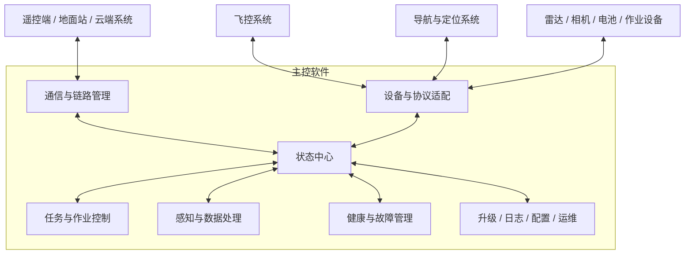
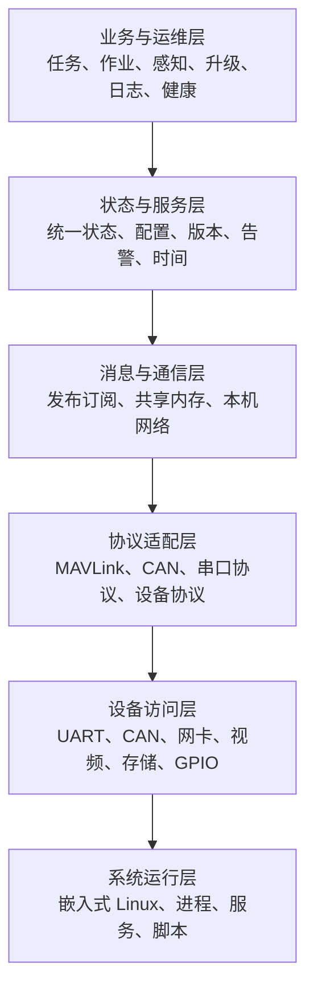
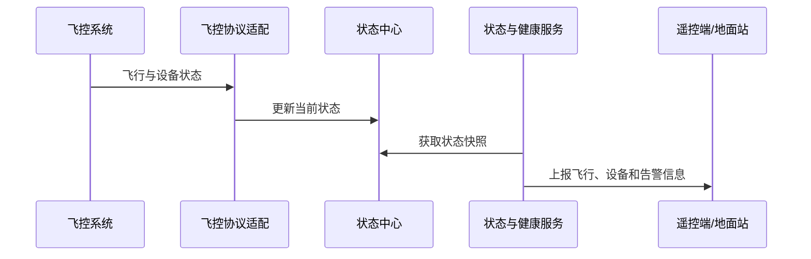
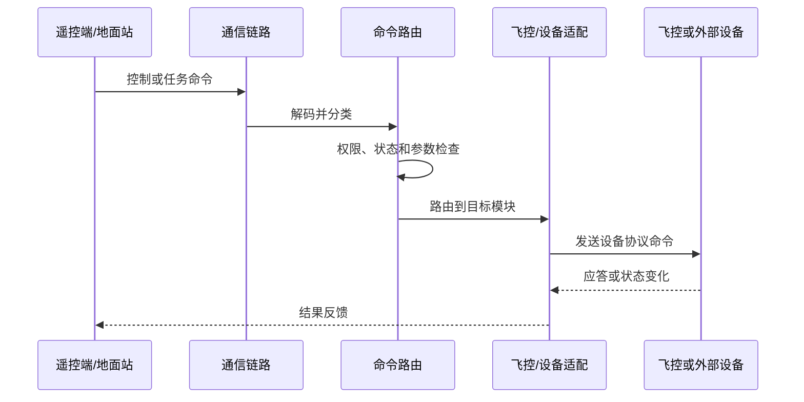
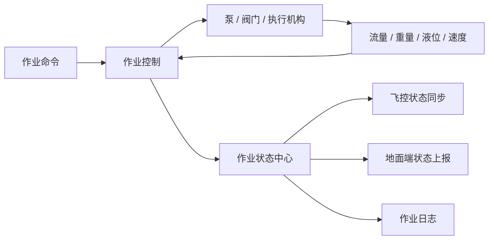

# 现有主控软件功能与框架梳理

## 1. 文档目的

本文从产品和系统架构视角，对现有主控软件的功能范围、逻辑分层、运行机制、数据流和系统边界进行整理。

本文重点回答以下问题：

- 主控软件承担哪些业务功能。
- 软件由哪些功能域构成。
- 各功能域之间如何通信和协作。
- 主控如何连接飞控、导航、遥控端和外部设备。
- 升级、日志、健康管理等运维能力如何融入整体系统。
- 当前框架具有什么特点和需要重点治理的问题。

本文不展开具体实现清单和硬件平台差异，也不作为目标系统的详细设计说明。

## 2. 系统定位

主控软件运行于机载嵌入式 Linux 计算平台，是飞控、导航、通信链路、任务载荷、感知设备和地面控制系统之间的综合业务中枢。

主控软件不直接替代飞控完成姿态稳定和基础飞行控制，而是重点承担以下职责：

- 汇聚飞行、导航、设备和作业状态。
- 接收并路由遥控端、地面站和任务系统命令。
- 管理数传、Wi-Fi、移动网络和本地通信链路。
- 接入相机、雷达、电池、执行机构和作业载荷。
- 实现任务规划、作业控制、感知处理和数据转发。
- 提供设备健康、日志、升级、配置和故障恢复能力。
- 为生产测试、维护诊断和仿真运行提供支撑。

总体上，现有软件属于“业务主控 + 设备接入 + 机载 OAM”一体化系统。

## 3. 总体功能视图

## 4. 软件功能域

### 4.1 飞控通信与飞行状态管理

飞控通信模块负责主控与飞控之间的双向数据交换。

主要功能包括：

- 接收飞行模式、解锁状态、姿态、位置、速度和高度等数据。
- 接收航点、任务执行状态和飞控告警。
- 接收飞控参数、设备版本和运行统计。
- 向飞控发送任务、控制、参数和状态同步消息。
- 转发作业控制、速度调整和任务规划结果。
- 支持飞控固件升级、版本查询和升级结果反馈。
- 保存必要的飞控通信与飞行过程日志。

飞控链路属于系统的关键链路，应与日志上传、文件下载等非实时业务进行资源隔离。

### 4.2 导航与定位管理

导航模块负责接入独立导航设备、GNSS 接收机或组合导航系统。

主要功能包括：

- 接收姿态、惯导、位置和时间信息。
- 解析 GNSS 定位状态、卫星状态和精度信息。
- 接收和转发差分定位数据。
- 维护主、副定位源的状态。
- 提供导航设备版本查询和升级能力。
- 向其他业务模块提供统一的时间和定位基准。
- 保存导航、GNSS 和差分数据日志。

### 4.3 遥控端与地面站通信

通信模块负责主控与遥控端、地面站及其他控制终端之间的数据交互。

主要功能包括：

- 接收飞行任务、作业任务和设备控制命令。
- 上报飞行、设备、作业、告警和升级状态。
- 转发飞控、导航、雷达和载荷数据。
- 管理多个控制终端的连接状态和控制权。
- 管理不同链路的带宽、优先级和切换状态。
- 支持文件、日志和升级任务传输。
- 支持设备绑定、身份信息和配置同步。

### 4.4 网络与链路管理

网络管理模块负责机载有线网络、Wi-Fi、移动网络和专用数传链路的配置与运行维护。

主要功能包括：

- Wi-Fi AP 和终端模式管理。
- 网络地址、路由、端口和转发规则配置。
- 网络连接、信号强度、速率和丢包状态监测。
- 数传链路、移动网络和本地网络的切换与协同。
- 网络服务启停和异常恢复。
- 视频、遥测、文件和控制数据的通道分配。
- 网络诊断、抓包和链路日志采集。

### 4.5 CAN 与外设接入

外设接入模块通过 CAN、串口或网络连接机载设备和任务载荷。

典型设备包括：

- 电机和电调。
- 电池和电源管理模块。
- 雷达和避障设备。
- 泵、阀门、流量计和液位设备。
- 播撒、喷洒、吊运等作业载荷。
- 灯光、蜂鸣器和其他辅助设备。

主要功能包括：

- 设备发现和在线状态维护。
- 协议解析和数据标准化。
- 控制指令发送和应答处理。
- 故障码、告警和运行参数采集。
- 设备版本查询和固件升级。
- 通信质量和总线异常统计。

### 4.6 作业控制

作业控制模块负责将飞行任务和作业任务转换为对具体执行机构的控制。

主要功能包括：

- 喷洒、播撒、吊运等作业模式管理。
- 泵速、阀门、流量和执行机构控制。
- ADC、重量、液位和流量数据采集。
- 基于速度、流量和目标用量的闭环调节。
- 作业参数、标定参数和设备类型管理。
- 作业启停、异常中止和安全互锁。
- 作业面积、用量、剩余量和运行状态统计。
- 将作业状态同步给飞控和地面控制端。

### 4.7 任务与路径处理

任务模块负责处理航线、航点和具体业务任务。

主要功能包括：

- 接收和解析任务文件。
- 管理任务标识、任务类型、任务进度和任务状态。
- 生成或调整航点、路径和作业参数。
- 支持断点、返航和任务恢复相关数据管理。
- 向飞控发送任务和路径结果。
- 向地面站反馈任务执行情况。
- 支持航测、作业和其他专用任务逻辑。

### 4.8 感知、雷达与 AI

感知模块负责接入雷达、相机和智能计算能力，为避障、地形跟随、目标识别和任务决策提供数据。

主要功能包括：

- 接收前向、后向、下视或旋翼周边雷达数据。
- 维护障碍物、地形和空间环境状态。
- 获取相机视频和抓拍图像。
- 对感知数据进行预处理、转换和转发。
- 支持 AI 模型、识别程序和算法组件升级。
- 向飞控、任务系统和地面端输出感知结果。
- 支持仿真数据注入和感知链路调试。

### 4.9 相机与视频

视频模块负责机载相机采集、编码、传输和抓拍。

主要功能包括：

- 相机设备发现和运行状态检测。
- 视频采集、编码和码流输出。
- 视频通道和目标地址配置。
- 抓拍、录像和保存控制。
- 视频链路状态和异常统计。
- 为 AI、地面站和任务系统提供图像数据。
- 支持网络抖动、丢包和弱网条件下的传输处理。

### 4.10 系统状态与健康管理

健康管理模块负责汇聚主控、飞控、导航、通信和外设的运行状态。

主要功能包括：

- CPU、内存、温度和存储空间监测。
- 网络、串口、CAN 和设备在线状态监测。
- 飞控、导航、作业和载荷告警汇总。
- 进程心跳、丢失和重启次数统计。
- 电池、电源和掉电状态监测。
- 设备版本、期望版本和升级状态维护。
- 向地面端提供统一设备健康视图。
- 记录故障、恢复和系统重启事件。

### 4.11 升级管理

升级模块负责主控应用、飞控、导航、通信模块、感知设备、作业外设和算法模型的升级编排。

主要功能包括：

- 接收升级任务和升级文件信息。
- 下载或接收升级包。
- 校验文件类型、目标模块、版本、长度和完整性。
- 检查飞行状态、电量、设备在线状态等升级前置条件。
- 根据设备类型选择串口、CAN、网络或本地安装路径。
- 管理升级进度、超时、重试和错误码。
- 汇总多个模块的升级结果。
- 触发必要的服务重启或整机重启。
- 向遥控端或地面站上报升级状态。

升级系统属于跨模块事务，应确保升级过程中不影响飞行关键链路。

### 4.12 日志管理

日志模块负责采集、保存、压缩、清理和上传运行证据。

日志范围包括：

- 飞行状态与飞控通信日志。
- 导航、GNSS 和差分数据日志。
- 主控系统状态日志。
- CAN、雷达、相机和网络日志。
- 电池、电源和作业状态日志。
- 进程运行、退出和重启事件。
- 升级过程和结果日志。
- Linux 系统、内核和脚本运行日志。

主要能力包括：

- 按时间或大小分包。
- 压缩和本地归档。
- 存储容量监测和循环清理。
- 日志请求、筛选和上传。
- 上传进度和结果反馈。
- 文件完整性校验。

### 4.13 配置与版本管理

配置管理覆盖：

- 设备身份和板卡信息。
- 产品和功能类型。
- 网络、数传和服务配置。
- 飞行和作业参数。
- 传感器和执行机构标定参数。
- 日志采集与上传策略。
- 当前版本、目标版本和组件版本。
- 调试、测试和仿真开关。

现有配置同时存在于文件、运行内存和启动参数中，需要通过明确的优先级、持久化和版本兼容规则进行治理。

### 4.14 电源与安全关机

电源管理模块负责处理正常关机、异常掉电和系统重启。

主要功能包括：

- 监测电源和总线电压。
- 识别掉电或关机事件。
- 通知关键模块停止写入和保存日志。
- 保存累计运行时间和关机原因。
- 同步文件系统并卸载存储设备。
- 控制系统重启或断电。
- 防止日志、任务和配置文件在掉电过程中损坏。

### 4.15 生产测试、维护与仿真

辅助模块支持研发、生产和售后阶段的测试与诊断。

主要功能包括：

- 串口、CAN、网络、相机和外设自检。
- 设备版本和连接状态检查。
- 传感器、执行机构和作业系统标定。
- 工厂老化和生产测试。
- 飞行、雷达和任务数据仿真。
- 调试日志和网络诊断。
- 维护提醒、状态复位和远程诊断。

## 5. 软件总体框架

现有软件可以划分为六个逻辑层次。

### 5.1 系统运行层

系统运行层提供操作系统、进程、文件系统、驱动和网络运行环境。

主要特点：

- 运行于嵌入式 Linux。
- 使用多进程部署不同设备和业务功能。
- 通过启动脚本完成驱动、存储、网络和应用初始化。
- 使用内存文件系统保存高频临时数据。
- 使用持久存储保存配置、任务、版本和日志。
- 通过进程拉起和检查脚本实现基础故障恢复。

### 5.2 设备访问层

设备访问层屏蔽具体硬件访问细节，为上层提供统一的读写能力。

主要接口包括：

- UART 串口。
- CAN 总线。
- UDP/TCP 网络。
- 视频采集和编码接口。
- GPIO、ADC、PWM 和设备控制接口。
- 文件、存储和系统状态接口。

### 5.3 协议适配层

协议适配层负责协议帧解析、编码、校验、重试和设备状态维护。

主要协议类型包括：

- MAVLink 及业务扩展消息。
- CAN 和设备自定义消息。
- GNSS、RTCM 和导航数据。
- 数传设备私有协议。
- 雷达、相机、AI 和作业设备协议。
- 文件与固件升级传输协议。

### 5.4 消息与通信层

系统内部同时使用多种通信方式：

| 方式 | 主要用途 | 特点 |
|---|---|---|
| ROS 2 发布订阅 | 命令、事件、升级、设备数据转发 | 异步解耦，支持多发布者和多订阅者 |
| 共享内存 | 高频状态、配置、版本、心跳 | 本机访问快，但耦合度较高 |
| 本机 UDP | 状态转发或兼容既有模块 | 实现简单，可与非 ROS 模块连接 |
| 文件 | 配置、任务、日志、版本和控制标记 | 可持久化，但一致性依赖应用约定 |
| 信号与脚本 | 退出、重启、关机和辅助恢复 | 系统级控制直接，但策略较分散 |

当前系统不是纯 ROS 2 架构，而是“ROS 2 + 共享内存 + 本机网络 + 文件”的混合通信框架。

### 5.5 状态与服务层

状态与服务层维护整个系统的公共运行信息，包括：

- 飞行、导航和任务状态。
- 设备在线、健康和告警状态。      
- 作业系统状态。
- 网络和通信状态。
- 当前版本和期望版本。
- 升级进度和错误码。
- 进程心跳和重启次数。
- 系统时间和设备时间同步信息。         

这一层相当于现有系统的数据中枢，大量模块通过它共享当前状态。

### 5.6 业务与运维层

业务与运维层在公共状态和设备适配能力之上实现：

- 任务和路径处理。
- 作业闭环控制。
- 感知和视频业务。
- 设备状态上报。
- 升级编排。
- 日志采集和上传。
- 健康管理和故障诊断。
- 生产测试和仿真。

## 6. 运行框架

### 6.1 多进程模型

软件按设备链路和业务功能拆分为多个独立进程。

主要优点：

- 单个功能异常不必直接导致全部软件退出。
- 不同链路可以独立开发、部署和重启。
- 可通过进程优先级降低日志、上传等后台业务对关键链路的影响。
- 便于隔离不同设备 SDK 和协议库。

主要问题：

- 进程之间存在大量隐式共享状态。
- 启动顺序、就绪条件和依赖关系不够显式。
- 一个功能可能同时依赖消息、共享内存、文件和网络端口。
- 故障定位需要跨多个进程和日志来源关联。

### 6.2 发布订阅模型

发布订阅主要用于：

- 飞控命令和任务转发。
- 数传上下行消息。
- 作业数据和控制命令。
- 设备升级任务和结果。
- 时间同步、日志和设备检查。
- 雷达、AI 和仿真数据。

现有消息封装偏通用，部分业务数据需要二次编码后再传输。这样有利于快速接入私有协议，但类型安全、性能和接口兼容性依赖业务代码自身保证。

### 6.3 共享状态模型

共享状态按照整机、主控、飞控、导航、电源、作业、感知和外设等功能域组织。

适合放入共享状态的数据包括：

- 高频更新且被多个模块读取的状态。
- 当前配置和工作模式。
- 设备在线状态和最后更新时间。
- 版本、升级进度和错误状态。
- 告警、统计和进程心跳。

共享状态模型具有低延迟优势，但需要明确：

- 每个字段的唯一写入者。
- 数据更新时间和失效时间。
- 多字段快照的一致性。
- 软件版本变化时的数据结构兼容性。
- 异常进程写入错误数据时的隔离机制。

### 6.4 线程模型

单个进程内部通常包含以下线程或循环：

- 设备接收线程。
- 设备发送线程。
- 协议解析和消息分发线程。
- ROS 2 回调线程。
- 周期状态采集线程。
- 日志写入和压缩线程。
- 文件下载、上传和升级线程。
- 心跳和设备状态检查线程。

实时性要求较高的链路应避免与压缩、上传、文件扫描等耗时操作共享关键线程。

### 6.5 启动与恢复

系统启动通常经历以下阶段：

恢复机制主要包括：

- 进程异常退出后自动重新拉起。
- 进程心跳变化监测。
- 串口、网络和设备链路检查。
- 专用脚本重启异常服务。
- 系统重启或安全关机。

当前恢复能力偏向“发现异常后重启”，对连续失败、依赖故障、重启风暴和降级运行仍需要统一治理。

## 7. 关键数据流

### 7.1 飞行状态上报

### 7.2 控制命令下发

### 7.3 作业控制闭环

### 7.4 升级流程

### 7.5 日志流程

## 8. 横向公共能力

### 8.1 时间同步

系统需要统一以下时间来源：

- 系统启动后的单调运行时间。
- GNSS 时间。
- UTC 时间。
- 飞控和导航设备时间。
- 遥控端或网络提供的时间。

时间同步用于飞行日志、设备日志、告警、任务和升级证据的关联。系统应区分单调时钟和墙上时钟，避免时间回拨影响超时判断和日志排序。

### 8.2 设备身份

设备身份信息通常包括：

- 整机标识。
- 主控板和设备序列号。
- 产品类型和硬件版本。
- 各模块当前软件版本。
- 网络身份和通信标识。

设备身份同时被状态上报、升级、日志命名、设备绑定和云端管理使用，应由统一身份服务提供可信来源。

### 8.3 告警与事件

告警应覆盖：

- 飞行与导航异常。
- 通信链路异常。
- 设备离线和协议错误。
- 电源、电池和温度异常。
- 存储空间和文件系统异常。
- 作业设备和执行机构异常。
- 升级失败和版本不一致。
- 进程退出、卡死和频繁重启。

告警需要包含发生时间、来源、严重级别、持续时间、恢复状态和处置建议。

### 8.4 资源治理

主控上同时运行控制、感知、视频、日志和升级业务，需要进行资源分级：

| 等级 | 典型业务 | 资源策略 |
|---|---|---|
| 飞行关键 | 飞控、导航、控制命令 | 最高优先级，限制阻塞和动态分配 |
| 任务关键 | 作业闭环、感知和路径 | 保证时延，允许受控降级 |
| 运行保障 | 健康、状态和告警 | 保证周期性和故障证据 |
| 后台业务 | 日志压缩、上传、升级下载 | 限速、可暂停，不得挤占关键链路 |

## 9. 当前框架特点

### 9.1 优势

- 功能覆盖完整，已经形成飞控、导航、数传、设备、作业和运维闭环。
- 采用多进程隔离不同设备和业务功能。
- 支持多种硬件通信和设备协议。
- 具备飞行、作业、感知、升级和日志协同能力。
- 共享状态访问效率较高，适合机载高频数据使用。
- 发布订阅机制便于异步消息分发。
- 已考虑进程心跳、异常重启、掉电保护和存储清理。
- 已具备多设备升级、进度上报和飞行状态检查。
- 支持生产测试、维护诊断和仿真。

### 9.2 结构性问题

- 业务主控、设备接入和 OAM 功能边界交叉。
- 消息、共享内存、文件和本机网络同时承载业务状态，依赖关系较隐蔽。
- 公共状态由多个模块直接读写，状态所有权不够清晰。
- 通用消息封装缺少强类型接口和独立 Schema。
- 配置来源分散，缺少统一版本和事务管理。
- 启动、监控和故障恢复策略分散在应用和脚本中。
- 升级和日志协议的安全能力需要加强。
- 设备协议、业务编排和运行运维存在较强耦合。

## 10. 软件边界建议

为了便于后续演进，可将现有功能重新理解为以下边界。这里仅定义逻辑边界，不要求一次性重写。

### 10.1 安全控制域

负责：

- 飞控命令校验和转发。
- 飞行状态镜像。
- 解锁、飞行、返航等关键状态门控。
- 升级、重启和作业操作的安全条件检查。

该域应尽量小、依赖少、可验证，并避免承载上传、压缩和复杂文件处理。

### 10.2 设备适配域

负责：

- UART、CAN、UDP 和视频设备访问。
- 协议解析和编码。
- 设备状态、控制和升级传输。
- 将设备私有数据转换为统一数据模型。

### 10.3 任务与作业域

负责：

- 任务和路径管理。
- 作业模式和控制闭环。
- 感知结果使用和业务决策。
- 作业统计和任务状态。

### 10.4 平台服务域

负责：

- 状态、配置、时间和设备身份。
- 健康监测和进程治理。
- 网络和链路管理。
- 统一告警与事件。

### 10.5 OAM 域

负责：

- 软件和固件升级。
- 日志、指标和诊断证据。
- 远程配置和维护命令。
- 版本、发布和设备资产信息。

OAM 域应能独立限流和降级，避免影响飞行关键业务。

## 11. 总结

现有主控软件可以概括为：

> 以嵌入式 Linux 多进程为运行基础，以发布订阅和共享状态为内部协作方式，以串口、CAN 和网络协议连接飞控、导航、地面控制端及外部设备，在此之上提供任务、作业、感知、状态、升级、日志和健康管理能力。

软件已经具备较完整的产品功能，后续工作的重点不是简单增加模块，而是逐步明确功能边界、接口契约、状态所有权、资源优先级和安全信任关系，使现有能力能够被稳定测试、独立升级、可靠恢复和持续演进。
